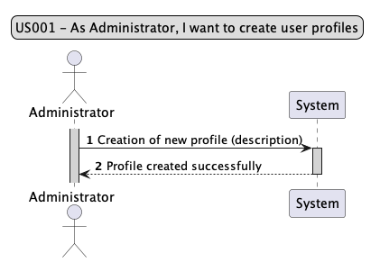
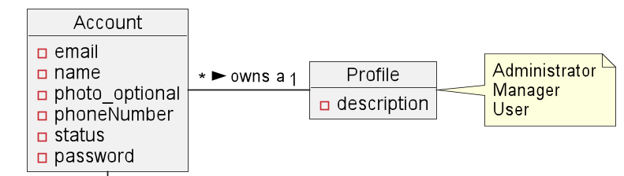
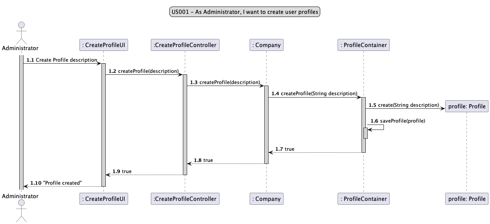
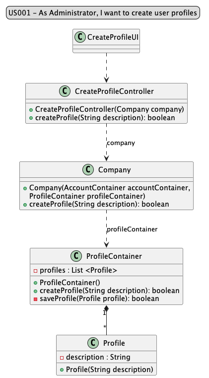
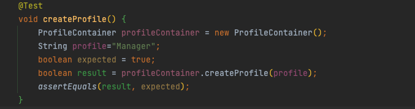
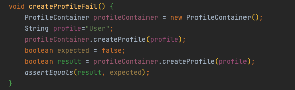

# US001 - As Administrator, I want to create user Profiles.

## 1. Requirements Engineering

### 1.1 User Story Description

#### As Administrator, I want to create user Profiles.

To be able to create a user profile, the administrator will need to enter a description ("User" or "Manager").

### 1.2 Customer Specifications and Clarification

From the specification document:

2.1 User Profiles and Roles

The system should allow the configuration of profiles associated with users, in order to restrict
access to features. Each profile will have permissions associated with available actions and
functionalities. A user account can have only one profile, but multiple roles.
When registration is made, it is automatically associated with the User profile, and then the
Administrator can change it to another available profile.
The Administrator profile allows associating profiles with the remaining users of the system,
and therefore an account with this profile should be automatically created at the time the
system is installed.
The Manager is a profile that allows the user to access all projects and manage resources. A
Manager doesn’t participate in projects.
The User profile corresponds to the resources that perform tasks/effort in the activities of the
projects.
The Project Manager, Product Owner, Scrum Master and Team Member are roles the users
have in a particular project over a certain period. For example, when creating a project on the
system, a user is defined as the manager of that project, making that user Project Manager,
keeping the other roles the user may have in the other projects to which he is assigned.

### 1.3 Accepted Criteria

n/a

### 1.4 Found out Dependencies

* This first user story has no dependency with another user story
* as it is the first step of the process

### 1.5 Input and Output Data

*Input Data:*
* Description 

*Output Data:*
* Profile created 

### 1.6 System Sequence Diagram (SSD)

### 1.7 Other Relevant Remarks

n/a

## 2. OO Analysis
### 2.1 Relevant Domain Model Excerpt

### 2.2 Other Remarks

n/a

## 3. Design - User Story Realization

### 3.1 Rationale

| Interaction ID | Question: Which class is responsible for... | Answer                  | Justification (with patterns)                                                                                                                                                     |
|--------------- |---------------------------------------------|-------------------------|-----------------------------------------------------------------------------------------------------------------------------------------------------------------------------------|
| Step 1         | ... interacting with the actor?             | CreateProfileUI         | Pure Fabrication: there is no reason to assign this responsibility to any existing class in the Domain Model.                                                                     |
|                | ... coordinating the US?                    | CreateProfileController | Controller: The direct communication of the UI to the domain classes must be avoided We use the Controller to ensure the decoupling between the UI layer and the Domain layer |
|                | ... knowing the database?                   | ProfileContainer        | Information Expert: knows/has its own data (Profiles)                                                                                                                             |

### 3.2 Sequence Diagram

### 3.3 Class Diagram

## 4. Tests

* *Success*

* *Fail*

* *ClassTests*

java
class CreateProfileControllerTest {...}

java
class CompanyTest {...}

java
class ProfileContainerTest {...}

java
class ProfileTest {...}

## 5. Integration and Demo

n/a

## 6. Observations

n/a 