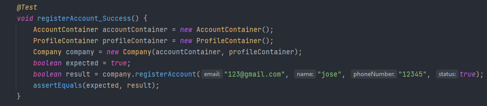

# US002 - As Administrator, I want to register a user.

## 1. Requirements Engineering

### 1.1 User Story Description

#### As Administrator, I want to register a user.

For the administrator be able to register an user, he needs to input some data. Like name, 
email and phone number. The status and profile, are given by default as active for status 
and "User" for profile

### 1.2 Customer Specifications and Clarification

>*From the specification document:*

*2.3.1 Register with the system*  
The system should make it possible for the Administrator to register users through a form
accessible via a link in the login zone. Each user's registration must request at least the
following information:
 - Name;
 - E-mail;
 - Phone number;
 - Photo (optional).  
 
Creating accounts in the system must ensure that the email address used is unique.
When creating a new user account, the user is automatically associated with the "User"
profile. The first time that the user logs into the system he has to create a password.
As long as the account is not associated with another profile or the user added to a project’s
team, the User will only be able to edit some of her/his profile data.

>*From client clarification:*

N/A

### 1.3 Accepted Criteria

Not yet given, or defined

### 1.4 Found out Dependencies

* In order to be able to register an account, the following dependencies where found:
    * *US001* As Administrator, I want to create user profiles.

### 1.5 Input and Output Data

*Input Data:*
* an email,
* a name,
* a phone number.
* a status,
* a profile.

*Output Data:*
* (In)Success of the operation.

### 1.6 Use-Case Diagram (UCD)

### 1.7 System Sequence Diagram (SSD)

### 1.8 Other Relevant Remarks

n/a

## 2. OO Analysis
### 2.1 Relevant Domain Model Excerpt

### 2.2 Other Remarks

N/A

## 3. Design - User Story Realization

### 3.1 Rationale

### 3.2 Sequence Diagram

### 3.3 Class Diagram

## 4. Tests

* *Success*

* *Fail*

## 5. Integration and Demo

N/A

## 6. Observations

N/A
