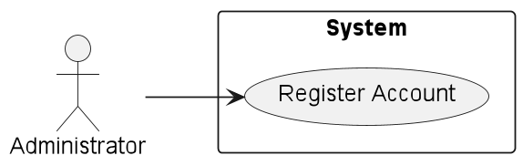
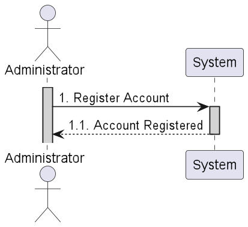
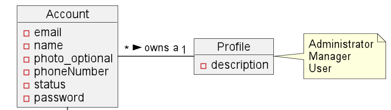
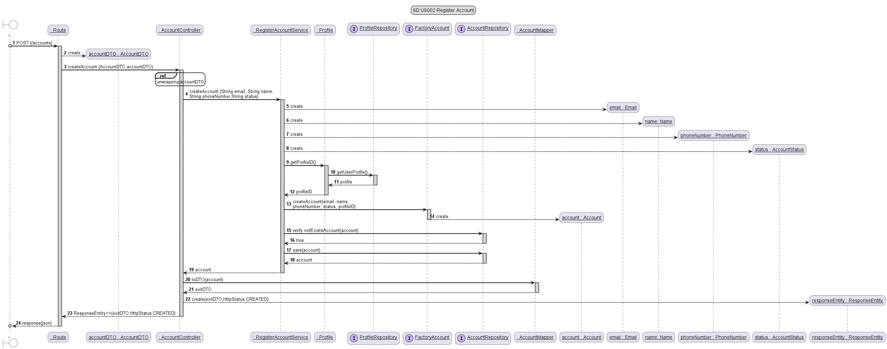
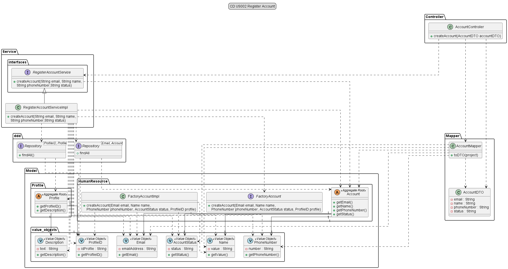

# US002 - As Administrator, I want to register a user.

## 1. Requirements Engineering

### 1.1 User Story Description

#### As Administrator, I want to register a user.

For the administrator be able to register an user, he needs to input some data. Like name, 
email and phone number. The status and profile, are given by default as active for status 
and "User" for profile

### 1.2 Customer Specifications and Clarification

*From the specification document:*

*2.3.1 Register with the system*  
The system should make it possible for the Administrator to register users through a form
accessible via a link in the login zone. Each user's registration must request at least the
following information:
 - Name;
 - E-mail;
 - Phone number;
 - Photo (optional).  
 
Creating accounts in the system must ensure that the email address used is unique.
When creating a new user account, the user is automatically associated with the "User"
profile. The first time that the user logs into the system he has to create a password.
As long as the account is not associated with another profile or the user added to a project’s
team, the User will only be able to edit some of her/his profile data.

>*From client clarification:*

N/A

### 1.3 Accepted Criteria

* The information that should be in the project listing is: email, name and phone number.
* Can't register an account with the same email.
* When registering an account, the default profile is user.

### 1.4 Found out Dependencies

* In order to be able to register an account, the following dependencies where found:
    * *US001* As Administrator, I want to create user profiles.

### 1.5 Input and Output Data

**Input Data:**
* an email,
* a name,
* a phone number.
* a status,
* a profile.

**Output Data:**
* (In)Success of the operation.

### 1.6 Use-Case Diagram (UCD)

### 1.7 System Sequence Diagram (SSD)

## 2. OO Analysis

### 2.1 Relevant Domain Model Excerpt

## 3. Design - User Story Realization

### 3.1 Rationale

| Interaction ID | Question: Which class is responsible for...      | Answer                         | Justification (with patterns)                                                                                   |
|----------------|--------------------------------------------------|--------------------------------|-----------------------------------------------------------------------------------------------------------------|
| Step 1         | ... interacting with the actor?                  | UI                             | Pure fabrication: collecting data from the user                                                                 |
| Step 2         | ... coordinating the user story?                 | AccountController              | Controller : coordinating and distributing the actions performed on  the User Interface to the domain layer |
| Step 3         | ... validate/collect data globally?              | RegisterAccountService         | Pure fabrication: handle the logical part of the process                                                        |
|                | ... knowing the database?                        | Repository<Email, Account>     | Information Expert: have access to all Accounts                                                                 |
|                | ... knowing the database?                        | Repository<ProfileID, Profile> | Information Expert: have access to all Profiles                                                                 |
|                | ... shows the data?                              | Account                        | Information Expert: knows its own data                                                                          |
|                | ... shows the data?                              | Profile                        | Information Expert: knows its own data                                                                          |
|                | ... maps the data?                               | AccountMapper                  | Pure fabrication: maps the domain objects to DTOs                                                               |
| Step 4         | ... providing message of success/fail to the UI? | UI                             | Information Expert: responsible for user interaction                                                            |

### 3.2 Sequence Diagram

### 3.3 Class Diagram

## 4. Tests

* *Success*

    @Test
    void createAccount_ShouldCreateAndSaveAValidAccount_Unit() {
        // Arrange
        String emailInput = "email@email.com";
        String nameInput = "John Doe";
        String phoneNumberInput = "923456789";
        String statusInput = "active";
        String profileDescription = "user";

        when(profileRepository.findAll()).thenReturn(List.of(profile));

        Optional<Profile> profileOptional = mock(Optional.class);
        when(profileOptional.isPresent()).thenReturn(true);
        when(profileOptional.get()).thenReturn(profile);
        when(profile.getDescription()).thenReturn(description);
        when(description.getDescription()).thenReturn(profileDescription);

        when(profile.getProfileID()).thenReturn(profileID);

        when(factoryAccount.createAccount(email, name, phoneNumber, accountStatus, profileID)).thenReturn(account);
        when(accountRepository.save(any())).thenReturn(account);

        Account expected = factoryAccount.createAccount(email, name, phoneNumber, accountStatus, profileID);

        // Act
        Account accountResult = serviceUnderTest.createAccount(emailInput, nameInput, phoneNumberInput, statusInput);

        // Assert
        assertEquals(expected, accountResult);
    }

* *Exception*

    @Test
    void createAccount_ShouldThrowSecurityExceptionWhenAccountAlreadyExists_Unit() {
        // Arrange
        String emailInput = "email@email.com";
        String nameInput = "John Doe";
        String phoneNumberInput = "923456789";
        String statusInput = "active";
        String profileDescription = "user";

        Email email1 = new Email(emailInput);
        Name name1 = new Name(nameInput);
        PhoneNumber phoneNumber1 = new PhoneNumber(phoneNumberInput);
        AccountStatus accountStatus1 = new AccountStatus(statusInput);

        when(profileRepository.findAll()).thenReturn(List.of(profile));

        Optional<Profile> profileOptional = mock(Optional.class);
        when(profileOptional.isPresent()).thenReturn(true);
        when(profile.getDescription()).thenReturn(description);
        when(description.getDescription()).thenReturn(profileDescription);

        when(profile.getProfileID()).thenReturn(profileID);

        when(email.getEmail()).thenReturn(emailInput);

        when(factoryAccount.createAccount(email1, name1, phoneNumber1, accountStatus1, profileID)).thenReturn(account);
        when(accountRepository.containsOfIdentity(email1)).thenReturn(true);

        // Act
        Throwable exception = assertThrows(IllegalArgumentException.class, () -> {
            serviceUnderTest.createAccount(emailInput, nameInput, phoneNumberInput, statusInput);
        });

        //Assert
        assertEquals("User account already exists.", exception.getMessage());
    }
