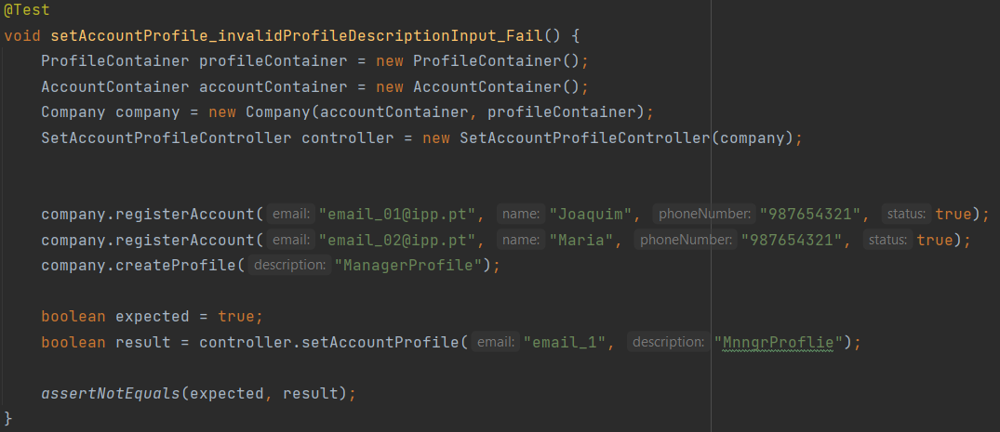

# US003 - As Administrator, I want to change the profile of a user account.

## 1. Requirements Engineering

### 1.1 User Story Description

As Administrator, I want to change the profile of a user account. Using two parameters, 
the email to determine the account, and the description to set the profile, the 
User Story will verify if the both parameters exist, and therefore it will change the profile.

### 1.2 Customer Specifications and Clarification

*From the specification document:* 
The system should allow the configuration of profiles associated with users, in order to restrict 
access to features. Each profile will have permissions associated with available actions and 
functionalities. A user account can have only one profile, but multiple roles. 

When registration is made, it is automatically associated with the User profile, and then the 
Administrator can change it to another available profile. 

The Administrator profile allows associating profiles with the remaining users of the system, and 
therefore an account with this profile should be automatically created at the time the system is 
installed. 

The Manager is a profile that allows the user to access all projects and manage resources. A Manager 
does not participate in projects.

The User profile corresponds to the resources that perform tasks/effort in the activities of the 
projects.

*From client clarification:*
>- Question: The roles Team Member, Scrum master(SM), Project manager(PM) e Product owner(PO) are 
>specific functions?
>Or the SM, PM and PO are also Team Members?
>
>
>
>- Answer: The SM, PM and PO are not Team Members.

### 1.3 Acceptance Criteria
* N/A.

### 1.4 Found out Dependencies
* To be able to change the profile of a user account, the following dependencies where found:
  * US001 - As Administrator, I want to create user profiles.
  * US002 - As Administrator, I want to register a user.

### 1.5 Input and Output Data
*Input data:*
* *Typed data:*
  * email
  * description
* *Selected data:*
  * N/A

*Output Data:*
* Profile Set Successfully.

### 1.6 Use case Diagram (UCD)

### 1.7 System Sequence Diagram (SSD)

### 1.8 Other Relevant Remarks
* N/A

## 2. OO Analysis
### 2.1 Relevant Domain Model Excerpt

### 2.2 Other Remarks
* N/A

## 3. Design - User Story Realization### 3.1 Rationale
## 3.1 Rationale
| Interaction ID | US003       | Question: Which class is responsible for...                        | Answer                      | Justification                                                                                                |
|----------------|-------------|--------------------------------------------------------------------|-----------------------------|--------------------------------------------------------------------------------------------------------------|
| Step 1         | SD 1.1      | ... interacting with the actor?                                    | SetAccountProfileUI         | Pure Fabrication: there is no reason to assign this responsibility to any existing class in the Domain Model |
| Step 2         | SD 1.2      | ... interacting with the UI layer and coordinating the user story? | SetAccountProfileController | The Controller is responsible for receiving or handling a system operation to coordinate the user story      |
| Step 4         | SD 1.3/1.10 | ... knowing the Profiles of the system?                            | AccountContainer            | Information Expert: knows every account of the system                                                        |
|                |             | ... knowing the Accounts of the system?                            | ProfileContainer            | Information Expert: knows every profile of the system                                                        |
| Step 5         | SD 1.11     | ... providing data to the UI?                                      | SetAccountProfileController | Controller: informs operation success                                                                        |
| Step 6         | SD 1.12     | ... providing data to the Actor?                                   | SetAccountProfileUI         | Information Expert: Is responsible for user interactions                                                     |

### 3.2 Sequence Diagram

### 3.3 Class Diagram

## 4. Tests
* *Integration Test Success*

* *Unit Test Success*

* *Integration Test Fail*

## 5. Integration and Demo
* N/A

## 6. Observations
* N/A
