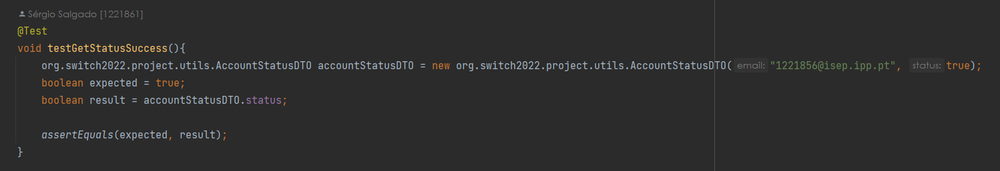

# US004 - As Administrator, I want to get a list of all user accounts and their status

## 1. Requirements Engineering

### 1.1 User Story Description

For this user story, the actor asks to list all accounts and their status. It will visualize a list with all the accounts emails and their corresponding status.

### 1.2 Customer Specifications and Clarification

*From the specification document:*

The system should have an administration area, which allows the Administrator to perform the following activities:
List all system users;

*From client clarification:*
* N/A

### 1.3 Accepted Criteria
* N/A

### 1.4 Found out Dependencies
* In order to be able to list all user accounts and their status:
    * US002 - As Administrator, I want to register a user
  

### 1.5 Input and Output Data

* Input Data: N/A

* Output Data: Display list

### 1.6 Use Case Diagram (UCD)

### 1.7 System Sequence Diagram (SSD)

### 1.8 Other Relevant Remarks
* N/A

## 2. OO Analysis

### 2.1 Relevant Domain Model Excerpt

### 2.2 Other Remarks
* N/A

## 3. Design - User Story Realization

### 3.1 Rationale

|  Interaction ID | US004        | Question: Which class is responsible for...                        | Answer                     | Justification                                                                                                |
|-----------------|--------------|--------------------------------------------------------------------|----------------------------|--------------------------------------------------------------------------------------------------------------|
| Step 1          | SD 1.1       | ... interacting with the actor?                                    | AccountsAndStatusUI        | Pure Fabrication: there is no reason to assign this responsibility to any existing class in the Domain Model |
| Step 2          | SD 1.2       | ... interacting with the UI layer and coordinating the user story? | AccountAndStatusController | The Controller is responsible for receiving or handling a system operation to coordinate the user story      |
| Step 3          | SD 1.3       | ... knowing the data containers?                                   | Company                    | Information Expert: have access to all containers                                                            |
| Step 4          | SD 1.4/1.6   | ... knowing the Accounts of the system?                            | AccountContainer           | Information Expert: knows every account of the system                                                        |
| Step 5          | SD 1.9/1.12  | ... list Account DTO                                               | AccountStatusMapper        | Pure Fabrication: AccountStatusMapper transforms the data between layers                                     |
| Step 6          | SD 1.13/1.14 | ... providing data to the UI?                                      | AccountAndStatusController | Controller: Informs operation success                                                                        |
| Step 6          | SD 1.15      | ... providing data to the Actor?                                   | AccountAndStatusUI         | Information Expert: Is responsible for user interactions                                                     |

### 3.2 Sequence Diagram

### 3.3 Class Diagram

## 4. Tests

* testGetEmailSuccess

* testGetEmailNotSuccess

* testGetStatusSuccess

  
* testGetStatusNotSuccess

## 5. Integration and Demo
* N/A

## 6. Observations
* N/A