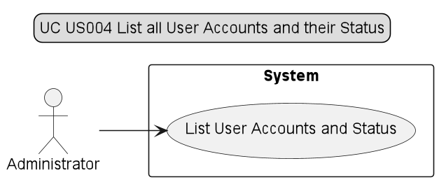
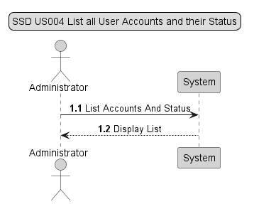
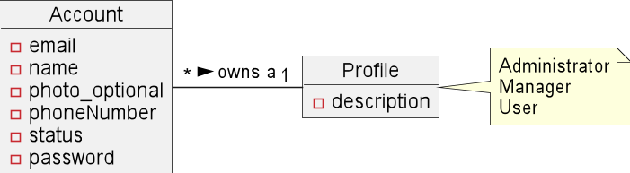
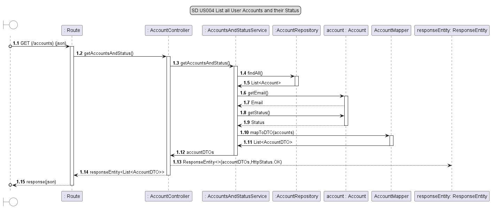
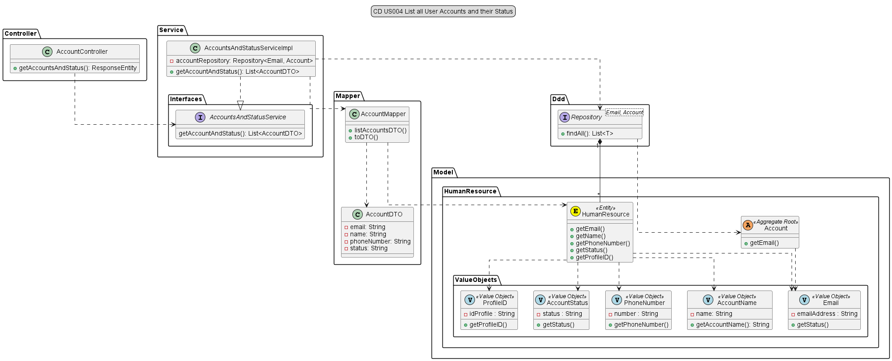

# US004 - As Administrator, I want to get a list of all user accounts and their status

## 1. Requirements Engineering

### 1.1 User Story Description

For this user story, the actor asks to list all accounts and their status. It will visualize a list with all the accounts emails and their corresponding status.

### 1.2 Customer Specifications and Clarification

*From the specification document:*

The system should have an administration area, which allows the Administrator to perform the following activities:
List all system users;

*From client clarification:*
* N/A

### 1.3 Accepted Criteria
* N/A

### 1.4 Found out Dependencies
* In order to be able to list all user accounts and their status:
    * US002 - As Administrator, I want to register a user
  

### 1.5 Input and Output Data

* Input Data: N/A

* Output Data: Display list

### 1.6 Use Case Diagram (UCD)

### 1.7 System Sequence Diagram (SSD)

### 1.8 Other Relevant Remarks
* N/A

## 2. OO Analysis

### 2.1 Relevant Domain Model Excerpt

### 2.2 Other Remarks
* N/A

## 3. Design - User Story Realization

### 3.1 Rationale

| Interaction ID | US004          | Question: Which class is responsible for...                         | Answer                  | Justification (with patterns)                                                                                |
|----------------|----------------|---------------------------------------------------------------------|-------------------------|--------------------------------------------------------------------------------------------------------------|
| Step 1         | SD 1.2         | ... interacting with the UI layer, and coordinating the user story? | AccountController       | The Controller is responsible for receiving or handling a system operation to coordinate the user story      |
| Step 2         | SD 1.3         | ... interacting with the controller?                                | AccountAndStatusService | Information Expert: have access to all repositories                                                          |
| Step 3         | SD 1.4 - 1.5   | ... knowing the database?                                           | AccountRepository       | Information Expert: knows/has all Projects                                                                   |
| Step 4         | SD 1.6 - 1.9   | ... showing the data?                                               | Account                 | Information Expert: knows its own data                                                                       |
| Step 5         | SD 1.10 - 1.12 | ... creating a list of accounts DTO                                 | AccountMapper           | Pure Fabrication: there is no reason to assign this responsibility to any existing class in the Domain Model |                                                                     |
| Step 6         | SD 1.13 - 1.15 | ... providing data to the UI?                                       | AccountController       | Controller: informs operation success                                                                        |

### 3.2 Sequence Diagram

### 3.3 Class Diagram

## 4. Tests

* *Success*
  * ensure get list of accounts

        @Test
        void listAccountsDTO_Regular_Success() {
        String emailInput1 = "email1@email.com";
        String nameInput1 = "name1";
        String phone1 = "912345678";
        String statusInput1 = "active";

        String emailInput2 = "email2@email.com";
        String nameInput2 = "name2";
        String phone2 = "912345679";
        String statusInput2 = "active";

        Email email1= mock(Email.class);
        when(email1.getEmail()).thenReturn(emailInput1);
        Email email2= mock(Email.class);
        when(email2.getEmail()).thenReturn(emailInput2);

        Name name1 = mock(Name.class);
        when(name1.getValue()).thenReturn(nameInput1);
        Name name2 = mock(Name.class);
        when(name2.getValue()).thenReturn(nameInput2);

        PhoneNumber phoneNumber1 = mock(PhoneNumber.class);
        when(phoneNumber1.getPhoneNumber()).thenReturn(phone1);
        PhoneNumber phoneNumber2 = mock(PhoneNumber.class);
        when(phoneNumber2.getPhoneNumber()).thenReturn(phone2);

        AccountStatus accountStatus1 = mock(AccountStatus.class);
        when(accountStatus1.getStatus()).thenReturn(statusInput1);
        AccountStatus accountStatus2 = mock(AccountStatus.class);
        when(accountStatus2.getStatus()).thenReturn(statusInput2);

        Account act_1 = mock(Account.class);
        when(act_1.getEmail()).thenReturn(email1);
        when(act_1.getName()).thenReturn(name1);
        when(act_1.getPhoneNumber()).thenReturn(phoneNumber1);
        when(act_1.getStatus()).thenReturn(accountStatus1);

        Account act_2 = mock(Account.class);
        when(act_2.getEmail()).thenReturn(email2);
        when(act_2.getName()).thenReturn(name2);
        when(act_2.getPhoneNumber()).thenReturn(phoneNumber2);
        when(act_2.getStatus()).thenReturn(accountStatus2);

        List<Account> accounts = new ArrayList<>();
        accounts.add(act_1);
        accounts.add(act_2);

        AccountDTO actDTO_1 = new AccountDTO();
        actDTO_1.setEmail(emailInput1);
        actDTO_1.setName(nameInput1);
        actDTO_1.setPhoneNumber(phone1);
        actDTO_1.setStatus(statusInput1);

        AccountDTO actDTO_2 = new AccountDTO();
        actDTO_2.setEmail(emailInput2);
        actDTO_2.setName(nameInput2);
        actDTO_2.setPhoneNumber(phone2);
        actDTO_2.setStatus(statusInput2);

        List<AccountDTO> expected = new ArrayList<>();
        expected.add(actDTO_1);
        expected.add(actDTO_2);

        //Act
        List<AccountDTO> result = AccountMapper.listAccountsDTO(accounts);

        //Assert
        for (int i = 0; i < expected.size(); i++) {
            assertEquals(expected.get(i).getEmail(), result.get(i).getEmail());
            assertEquals(expected.get(i).getName(), result.get(i).getName());
            assertEquals(expected.get(i).getPhoneNumber(), result.get(i).getPhoneNumber());
            assertEquals(expected.get(i).getStatus(), result.get(i).getStatus());
        }

        assertEquals(expected, result);
        assertEquals(expected.size(), result.size());
        }

