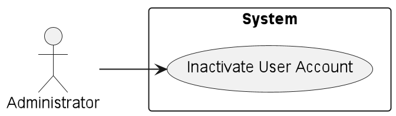
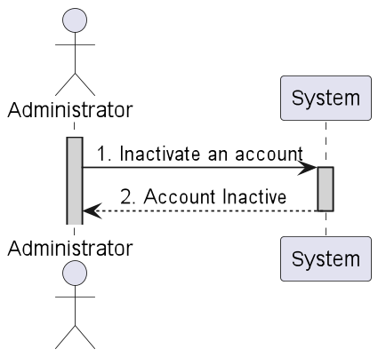
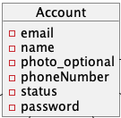
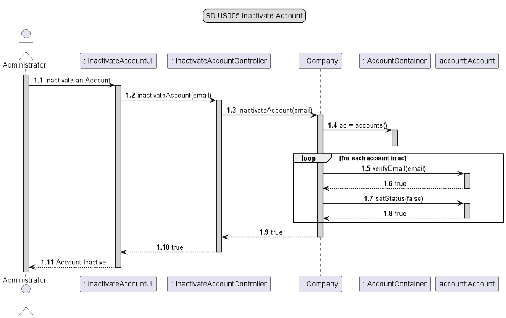
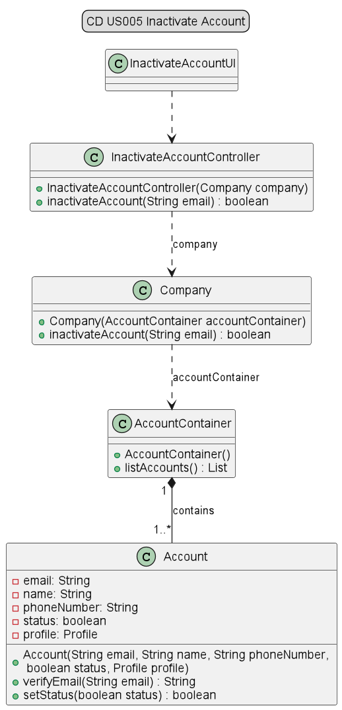
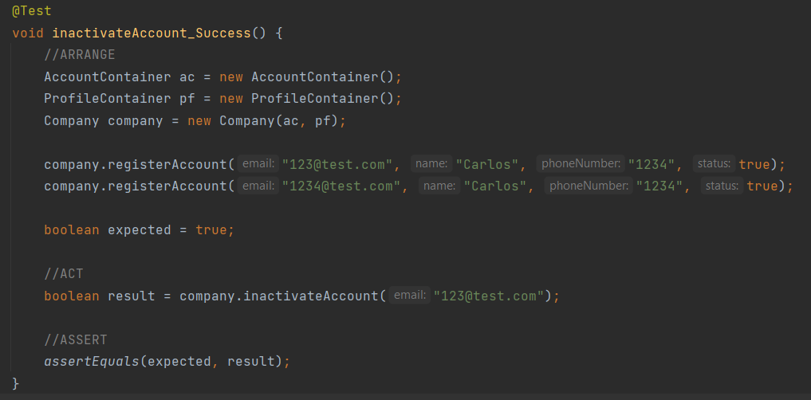
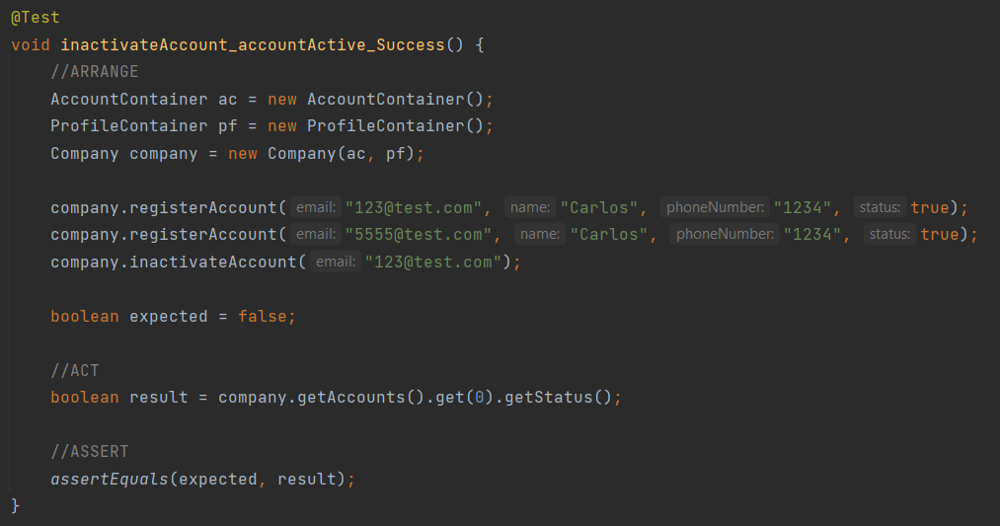
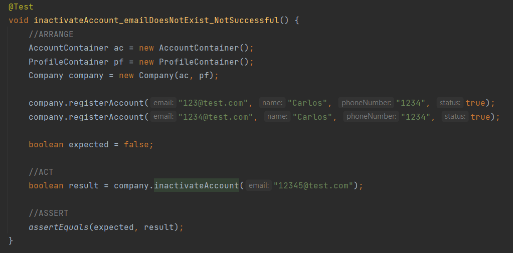

# US005 - As Administrator, I want to inactivate a user account.

## 1. Requirements Engineering

### 1.1 User Story Description

As Administrator, I want to inactivate a user account.
For this, the actor will need to enter the user's email.
If the typed email exists, the correspondent user account will turn inactivate.

### 1.2 Customer Specifications and Clarification

*From the specification document:*

*2.3.3 User Management* 

The system should have an administration area, which allows the Administrator to perform the following activities:

List all system users;

Search for users with availability of at least the following fields:

    E-mail;

    Profile.

Associate user accounts with existing profiles;

Activate and disable user accounts;

Edit other user account information.

*From client clarification:*
* n/a

### 1.3 Acceptance Criteria
* n/a

### 1.4 Found out Dependencies
* n/a

### 1.5 Input and Output Data

*Input Data:*

* *Typed data:*
  * email

* *Selected data:*
  * n/a

*Output Data:*

* Account Inactive

### 1.6 Use Case Diagram (UCD)

### 1.7 System Sequence Diagram (SSD)

### 1.8 Other Relevant Remarks
* n/a

## 2. OO Analysis

### 2.1 Relevant Domain Model Excerpt

### 2.2 Other Remarks

* n/a

## 3. Design - User Story Realization

### 3.1 Rationale

| Interaction ID | US005       | Question: Which class is responsible for...                        | Answer                      | Justification                                                                                                |
|----------------|-------------|--------------------------------------------------------------------|-----------------------------|--------------------------------------------------------------------------------------------------------------|
| Step 1         | SD 1.1      | ... interacting with the actor?                                    | InactivateAccountUI         | Pure Fabrication: there is no reason to assign this responsibility to any existing class in the Domain Model |
| Step 2         | SD 1.2      | ... interacting with the UI layer and coordinating the user story? | InactivateAccountController | The Controller is responsible for receiving or handling a system operation to coordinate the user story      |
| Step 3         | SD 1.3      | ... knowing the data containers?                                   | Company                     | Information Expert: have access to all containers                                                            |
| Step 4         | SD 1.4/1.7  | ... knowing the Accounts of the system?                            | AccountContainer            | Information Expert: knows every account of the system                                                        |
| Step 5         | SD 1.8/1.10 | ... providing data to the UI?                                      | InactivateAccountController | Controller: informs operation success                                                                        |
| Step 6         | SD 1.11     | ... providing data to the Actor?                                   | InactivateAccountUI         | Information Expert: Is responsible for user interactions                                                     |

### 3.2 Sequence Diagram

### 3.3 Class Diagram

## 4. Tests

* *Success*

* *Fail*

## 5. Integration and Demo
* n/a

## 6. Observations
* n/a

