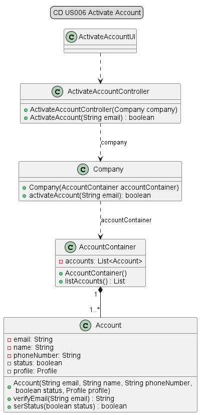
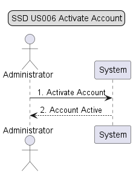
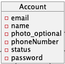
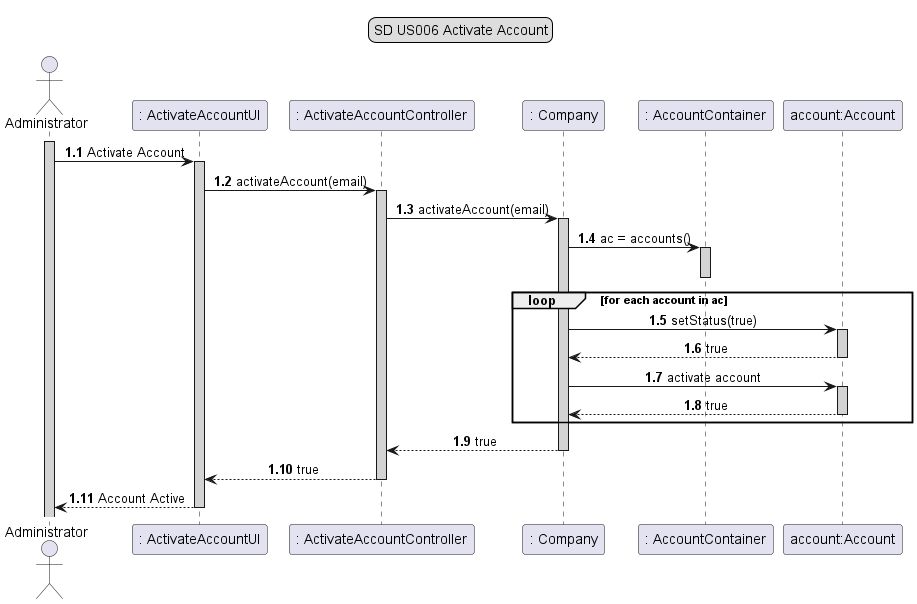

# US006 - As Administrator, I want to activate a user account.

## 1. Requirements Engineering

### 1.1 User Story Description

As Administrator, I want to activate a user account.
For this, the actor will need to enter the user's email.
If the typed email exists, the correspondent user account will be turmed activate.

### 1.2 Customer Specifications and Clarification

*From the specification document:*

*2.3.3 User Management* 

The system should have an administration area, which allows the Administrator to perform the following activities:

 * List all system users;

 * Search for users with availability of at least the following fields:

    Email;

    Profile.

 * Associate user accounts with existing profiles;

 * Activate user accounts;

 * Edit other user account information.
 * 

*From client clarification:*

* n/a

### 1.3 Acceptance Criteria

* n/a

### 1.4 Found out Dependencies

* n/a

### 1.5 Input and Output Data

*Input Data:*

* *Typed data:*
  * email

* *Selected data:*
  * n/a

*Output Data:*

* Account Active

### 1.6 Use Case Diagram (UCD)

### 1.7 System Sequence Diagram (SSD)

### 1.8 Other Relevant Remarks

* n/a

## 2. OO Analysis

### 2.1 Relevant Domain Model Excerpt

### 2.2 Other Remarks

* n/a

## 3. Design - User Story Realization

### 3.1 Rationale

| Interaction ID | Question: Which class is responsible for... | Answer                    | Justification (with patterns)                                                                                 |
|----------------|---------------------------------------------|---------------------------|---------------------------------------------------------------------------------------------------------------|
| Step 1         | ... interacting with the actor?             | ActivateAccountUI         | Pure Fabrication: there is no reason to assign this responsibility to any existing class in the Domain Model. |
| Step 2         | ... coordinating the US?                    | ActivateAccountController | The Controller its responsable by receiving data introduced by the user                                       |
| Step 3         | ... knowing the data container?             | Company                   | Information Expert: have access to all containers                                                             |
| Step 4         | ... knowing the account of the system?      | AccountContainer          | Information Expert: knows every accounts of the system                                                        |
| Step 5         | ... providing data to the UI?               | ActivateAccountController | Controller retunr: informs the operation suscess.                                                             |
| Step 6         | ... informing operation success?            | ActivateAccountUI         | Responsible for user interaction                                                                              |

### 3.2 Sequence Diagram (SD)

### 3.3 Class Diagram (CD)

## 4. Tests

* *Success*

* *Fail*

 

java
class ActivateAccountControllerTest {...}

java
class CompanyTest {...}

java
class AccountContainerTest {...}

## 5. Integration and Demo
* n/a

## 6. Observations
* n/a

