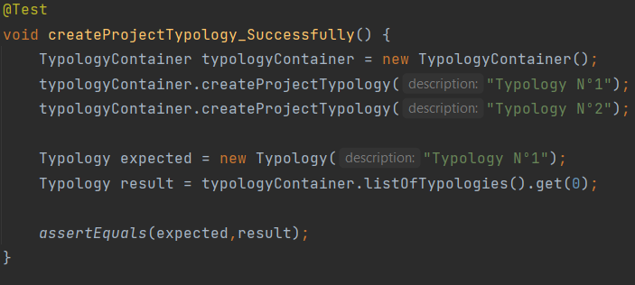
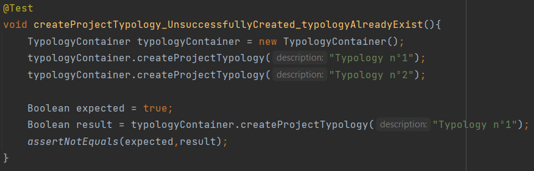

# US007 - As Administrator, I want to create a new project typology.

## 1. Requirements Engineering

### 1.1 User Story Description

 As Administrator, I want to create a new project typology. Using one parameter (description) that will
 be used to create the typology, the User Story will check if it exists, if not, it will create a new
 project typology.

### 1.2 Customer Specifications and Clarification

*From the specification document:*

Each project should have several pieces of information, one of which will be a typology.

*From client clarification:*
>- Question: Are there just two typologies or could there be more in the future?
>
>
>
>
>- Answer: There may always be more in the future.

### 1.3 Accepted Criteria
* Cannot have more than one typology with the same name.
* The first letter must be upper case.
* Cannot have special characters.
* The name must be a maximum of 40 characters, including spaces.
* Cannot be created a typology without name.

### 1.4 Found out Dependencies
* N/A - There are no dependencies.

### 1.5 Input and Output Data
*Input data:*
* *Typed data:*
    * description
* *Selected data:*
    * N/A

*Output Data:*
* Project typology created.

### 1.6 Use case Diagram (UCD)
[UC007_CreateProjectTypology.puml](UC007_CreateProjectTypology.puml)

### 1.7 System Sequence Diagram (SSD)
[SSD007_CreateProjectTypology.puml](SSD007_CreateProjectTypology.puml)

### 1.8 Other Relevant Remarks
* N/A

## 2. OO Analysis
### 2.1 Relevant Domain Model Excerpt
[US007 - Domain Model.puml](US007%20-%20Domain%20Model.puml)

### 2.2 Other Remarks
* N/A

## 3. Design - User Story Realization
### 3.1 Rationale
| Interaction ID | US007        | Question: Which class is responsible for...                        | Answer                   | Justification                                                                                                |
|----------------|--------------|--------------------------------------------------------------------|--------------------------|--------------------------------------------------------------------------------------------------------------|
| Step 1         | SD 1.1       | ... interacting with the actor?                                    | CreateProjectTypologyUI  | Pure Fabrication: there is no reason to assign this responsibility to any existing class in the Domain Model |
| Step 2         | SD 1.2       | ... interacting with the UI layer and coordinating the user story? | TypologyController       | The Controller is responsible for receiving or handling a system operation to coordinate the user story      |
| Step 3         | SD 1.3/1.3.1 | ... instantiating of a new project typology?                       | TypologyContainer        | Creator: TypologyContainer contains all the typologies, data and methods to create typologies                |                                                                                                              |
|                | SD 1.3.2     | ... knowing the Typologies of the system?                          | TypologyContainer        | Information Expert: knows every typology of the system                                                       |
| Step 4         | SD 1.4/1.5   | ... providing data to the UI?                                      | TypologyController       | Controller: informs operation success                                                                        |
| Step 5         | SD 1.6       | ... providing data to the Actor?                                   | CreateProjectTypologyUI  | Information Expert: Is responsible for user interactions                                                     |

### 3.2 Sequence Diagram
[SD007_CreateProjectTypology.puml](SD007_CreateProjectTypology.puml)

### 3.3 Class Diagram
[CD007_CreateProjectTypology.puml](CD007_CreateProjectTypology.puml)

## 4. Tests

* *Success*
  

* *Fail*
  

## 5. Integration and Demo
* N/A

## 6. Observations
* N/A

