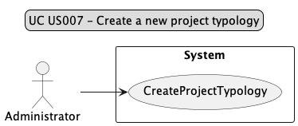
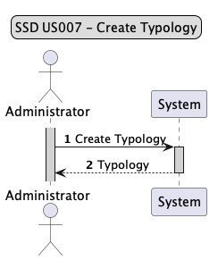
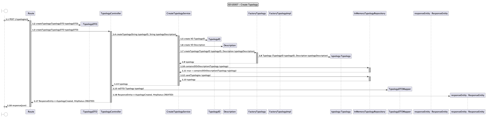
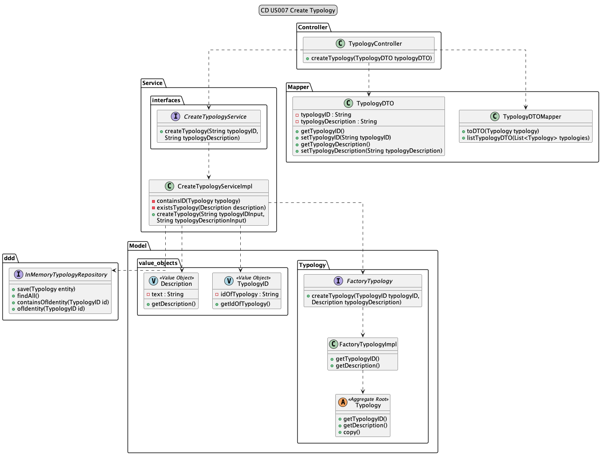

# US007 - As Administrator, I want to create a new project typology.

## 1. Requirements Engineering

### 1.1 User Story Description

 As Administrator, I want to create a new project typology. Using one parameter (description) that will
 be used to create the typology, the User Story will check if it exists, if not, it will create a new
 project typology.


### 1.2 Customer Specifications and Clarification

*From the specification document:*

The system must choose to create the customized one if all the requested data are filled in correctly and if
there is no typology with the same id or name.
 - TypologyID
 - Description


*From client clarification:*
N/A

### 1.3 Accepted Criteria
* Cannot have more than one typology with the same name.
* The name must be a maximum of 40 characters, including spaces.
* Cannot be created a typology without name.

### 1.4 Found out Dependencies
* N/A 

### 1.5 Input and Output Data
*Input data:*
* TypologyID
* Description
*Output Data:*
* typology created.

### 1.6 Use case Diagram (UCD)


### 1.7 System Sequence Diagram (SSD)


### 1.8 Other Relevant Remarks
* N/A

## 2. OO Analysis
### 2.1 Relevant Domain Model Excerpt


### 2.2 Other Remarks
* N/A

## 3. Design - User Story Realization


### 3.1 Sequence Diagram


### 3.2 Class Diagram


## 4. Tests

* *Success*
```java
 @Test
    void ensureTypologyIsCreated_Success() {
        //Arrange
        String typologyID_input = "TYP01";
        String typologyDescription_input = "Test_Typology";

        when(typology.getTypologyID()).thenReturn(typologyID);
        when(typology.getDescription()).thenReturn(typologyDescription);

        when(typologyID.getIdOfTypology()).thenReturn(typologyID_input);
        when(typologyDescription.getDescription()).thenReturn(typologyDescription_input);

        TypologyDTO typologyDTO = new TypologyDTO();
        typologyDTO.setTypologyID(typologyID_input);
        typologyDTO.setTypologyDescription(typologyDescription_input);

        when(createTypologyService.createTypology(typologyID_input, typologyDescription_input))
                .thenReturn(typology);

        ResponseEntity<Object> expected = new ResponseEntity<>(typologyDTO, HttpStatus.CREATED);
        //Act
        ResponseEntity<Object> result = typologyController.createTypology(typologyDTO);

        //Assert
        assertEquals(expected, result);
    }
```

* *Fail*
```java
@Test
    void ensureTypologyIsNotCreated_BadRequest_InvalidValidParameters() {
        // Arrange
        TypologyDTO invalidTypologyDTO = new TypologyDTO();
        invalidTypologyDTO.setTypologyID("typology");
        invalidTypologyDTO.setTypologyDescription("description");

        IllegalArgumentException exception = new IllegalArgumentException("Invalid input parameters for creating typology.");

        when(createTypologyService.createTypology(
                invalidTypologyDTO.getTypologyID(),
                invalidTypologyDTO.getTypologyDescription()
        )).thenThrow(exception);

        // Act
        ResponseEntity<Object> response = typologyController.createTypology(invalidTypologyDTO);

        // Assert
        assertEquals(HttpStatus.BAD_REQUEST, response.getStatusCode());
        assertEquals(exception.getMessage(), response.getBody());
    }
```

## 5. Integration and Demo
* N/A

## 6. Observations
* N/A


