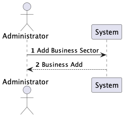
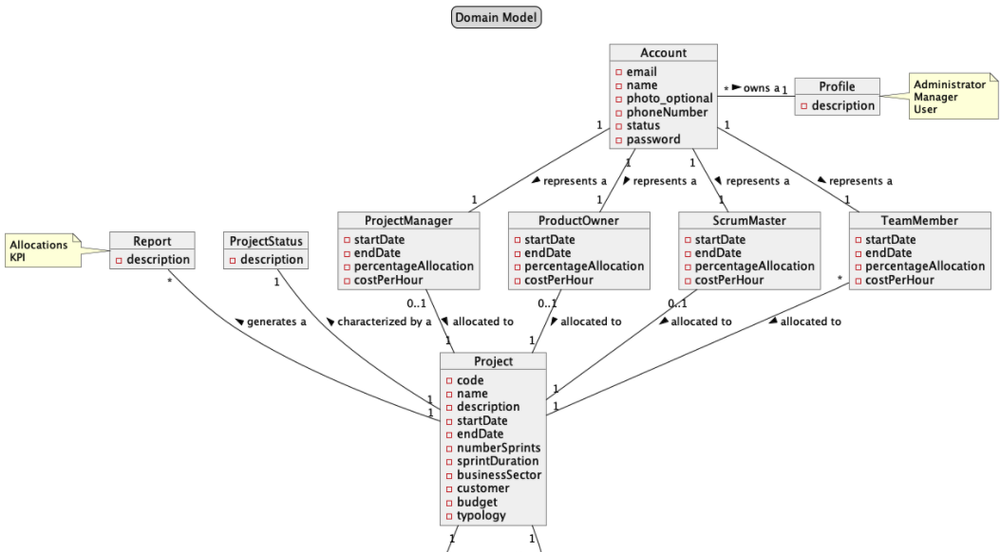
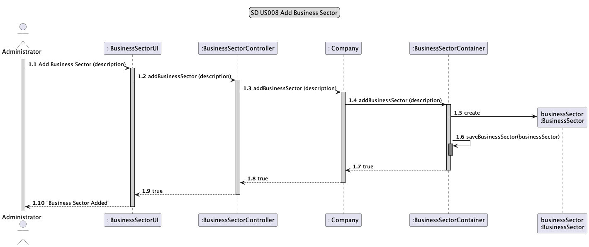
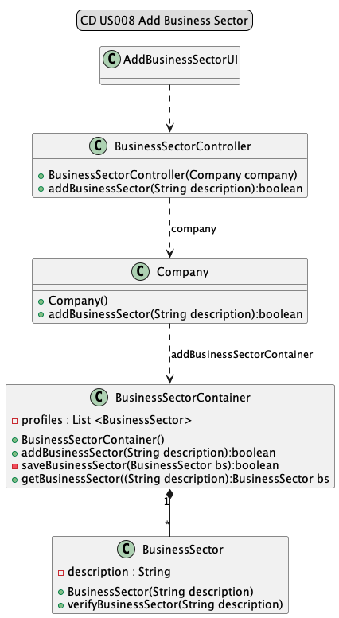
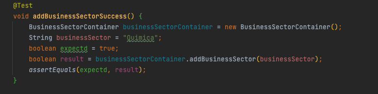
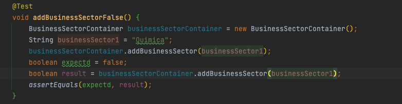

# US008 - As Administrator, I want to add Business Sector.

## 1. Requirements Engineering

### 1.1 User Story Description

#### As As Administrator, I want to add Business Sector.

### 1.2 Customer Specifications and Clarification

*From the specification document:*

> *2.4.5 Create Business Sector*
>>Admin is the only one capable of creating a business Sector.
The Business Sector contains as an attribute Description.
>>More attributes can always be added according to the allocation of new US.
The only restriction at this moment is that there cannot be Business Sectors with the same description.
> 
*From client clarification:*
>*Question:* O que quer dizer com business sector? Tem comportamento ou é só uma descrição?
>>*Answer:* Em que medida é que um setor de atividade pode ter comportamento? Não percebi.

###1.3 Accepted Criteria

* n/a

### 1.4 Found out Dependencies

* This user story only depends on the Admin implementing it.

### 1.5 Input and Output Data

*Input Data:*
* Description

*Output Data:*
* Business Sector created

### 1.6 System Sequence Diagram (SSD)

### 1.7 Other Relevant Remarks

n/a

## 2. OO Analysis
### 2.1 Relevant Domain Model Excerpt

### 2.2 Other Remarks

n/a

## 3. Design - User Story Realization

### 3.1 Rationale

| Interaction ID | Question: Which class is responsible for... | Answer                   | Justification (with patterns)                                                                                 |
|--------------- |---------------------------------------------|--------------------------|---------------------------------------------------------------------------------------------------------------|
| Step 1         | ... interacting with the actor?             | AddBusinessSectorUI      | Pure Fabrication: there is no reason to assign this responsibility to any existing class in the Domain Model. |
|                | ... coordinating the US?                    | BusinessSectorController | Controller                                                                                                    |
|                | ... knowing the database?                   | BusinessSectorContainer         | Information Expert: knows/has its own data (BusinessSector)                                                   |

### 3.2 Sequence Diagram

### 3.3 Class Diagram

## 4. Tests

* *Success*
* 

* *Fail*

* *ClassTests*

java
class BusinessSectorControllerTest {...}

java
class CompanyTest {...}

java
class BusinessSectorContainerTest {...}

java
class BusinessSectorTest {...}

## 5. Integration and Demo

n/a

## 6. Observations

n/a 