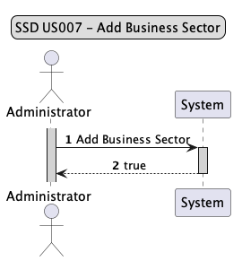
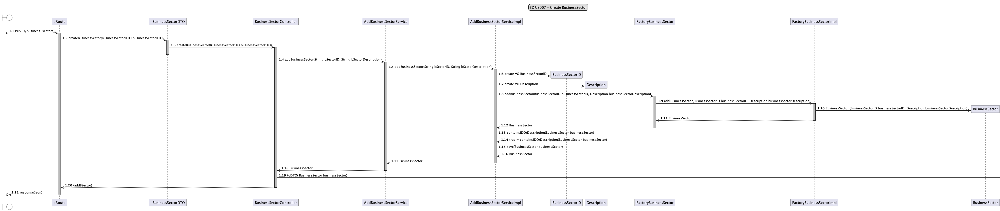
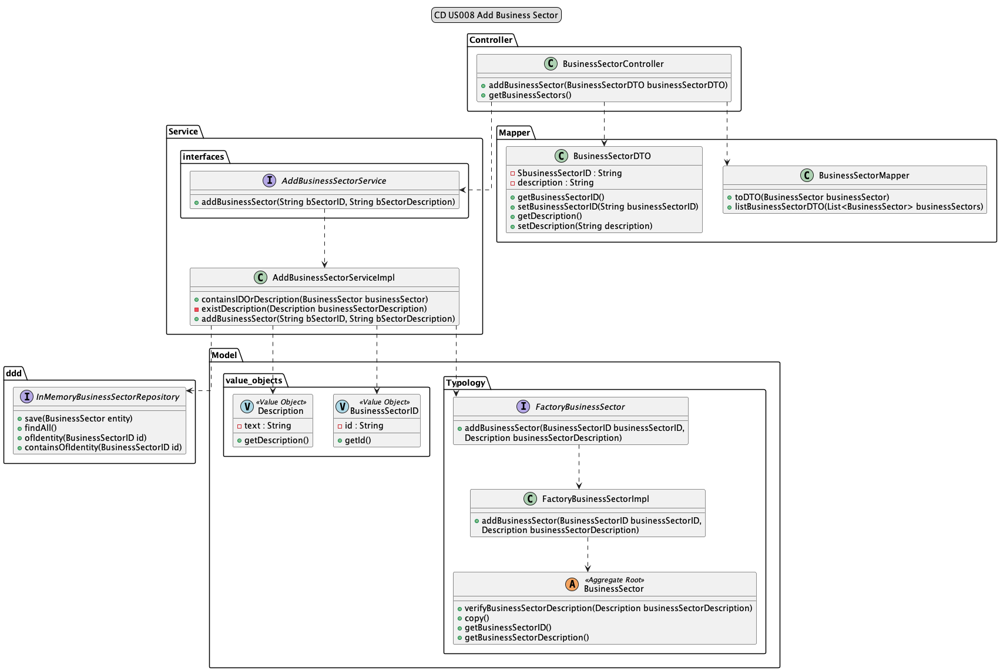

# US008 - As Administrator, I want to add Business Sector.

## 1. Requirements Engineering

### 1.1 User Story Description
As Administrator, I want to Create Business Sector
#### As As Administrator, I want to add Business Sector.

### 1.2 Customer Specifications and Clarification

*From the specification document:*

> *2.4.5 Create Business Sector*
Admin is the only one capable of creating a business Sector.
The Business Sector contains as an attribute Description.
More attributes can always be added according to the allocation of new US.
The only restriction at this moment is that there cannot be Business Sectors with the same description.

- BusinessSectorID
- Description
- 
*From client clarification:*
N/A


### 1.3 Accepted Criteria

* Cannot have more than one Business Sector with the same name.
* The name must be a maximum of 40 characters, including spaces.
* Cannot be created a typology without name.

### 1.4 Found out Dependencies

* This user story only depends on the Admin implementing it.

### 1.5 Input and Output Data

*Input Data:*
* BusinessSectorID
* Description

*Output Data:*
* Business Sector created


### 1.6 System Sequence Diagram (SSD)



### 1.7 Other Relevant Remarks

n/a

## 2. OO Analysis
### 2.1 Relevant Domain Model Excerpt


### 2.2 Other Remarks

n/a

## 3. Design - User Story Realization


### 3.1 Sequence Diagram



### 3.2 Class Diagram



## 4. Tests

* *Success*
```java
@Test
    void ensureBusinessSectorIsAdded_True() {
        //Arrange
        String bSectorID0 = "BS-1";
        String bSectorDescription0 = "finance";

        when(businessSector.getBusinessSectorID()).thenReturn(businessSectorID);
        when(businessSector.getBusinessSectorDescription()).thenReturn(description);

        when(businessSectorID.getId()).thenReturn(bSectorID0);
        when(description.getDescription()).thenReturn(bSectorDescription0);

        BusinessSectorDTO businessSectorDTO = new BusinessSectorDTO();
        businessSectorDTO.setBusinessSectorID(bSectorID0);
        businessSectorDTO.setDescription(bSectorDescription0);

        when(addBusinessSectorService.addBusinessSector(bSectorID0, bSectorDescription0))
                .thenReturn(businessSector);

        ResponseEntity<Object> expected = new ResponseEntity<>(businessSectorDTO, HttpStatus.CREATED);

        //Act
        ResponseEntity<Object> result = businessSectorController.addBusinessSector(businessSectorDTO);

        //Assert
        assertEquals(expected, result);
    }
```
* *Fail*
```java
  @Test
    void ensureBusinessSectorIsAdded_False() {
        //Arrange
        String bSectorID0 = null;
        String bSectorDescription0 = "finance";

        when(businessSector.getBusinessSectorID()).thenReturn(businessSectorID);
        when(businessSector.getBusinessSectorDescription()).thenReturn(description);

        when(businessSectorID.getId()).thenReturn(bSectorID0);
        when(description.getDescription()).thenReturn(bSectorDescription0);

        BusinessSectorDTO businessSectorDTO = new BusinessSectorDTO();
        businessSectorDTO.setBusinessSectorID(bSectorID0);
        businessSectorDTO.setDescription(bSectorDescription0);

        IllegalArgumentException exception = new IllegalArgumentException("Invalid parameters to add a Business Sector");

        when(addBusinessSectorService.addBusinessSector(bSectorID0, bSectorDescription0))
                .thenThrow(exception);

        //Act
        ResponseEntity<Object> result = businessSectorController.addBusinessSector(businessSectorDTO);

        //Assert
        assertEquals(HttpStatus.BAD_REQUEST, result.getStatusCode());
        assertEquals(exception.getMessage(), result.getBody());
    }
```

## 5. Integration and Demo

n/a

## 6. Observations

n/a 