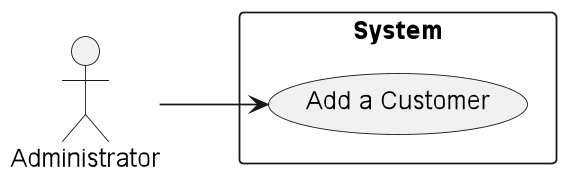
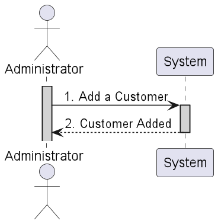
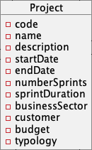
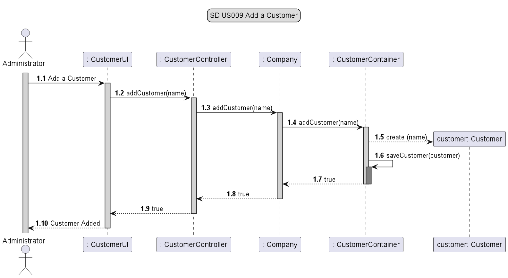
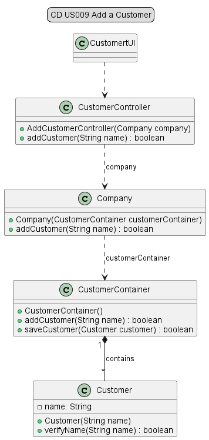
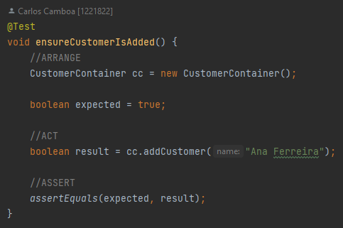
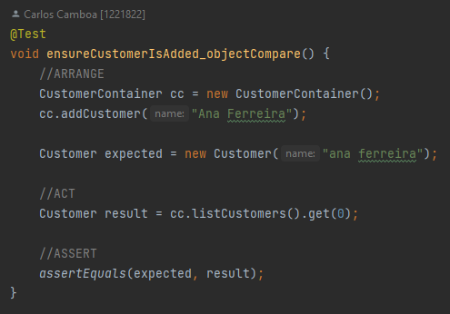
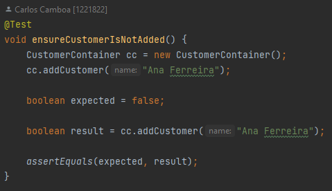

# US009 - As Administrator, I want to add a customer.

## 1. Requirements Engineering

### 1.1 User Story Description

As Administrator, I want to add a customer. For this, the actor will need to enter the customer's name.
The customer will be created and added to the list after verifying that it does not already exist.

### 1.2 Customer Specifications and Clarification

*From the specification document:*

Each project should have several pieces of information, one of which will be a customer.

*From client clarification:*
> Question: Customer attributes will be, for example, id, name, address, etc. ?
>
>
>
>Answer: For now, I don't see much use in having a lot of information about the customer. Customer designation will be
> enough.

> Question:
> Is it intended that a customer be created and added to a project?
>
>
>
>Answer: It just means that we want to add a customer to the system.

### 1.3 Acceptance Criteria

* n/a

### 1.4 Found out Dependencies

* n/a

### 1.5 Input and Output Data

*Input Data:*

* *Typed data:*
    * Name

* *Selected data:*
    * n/a

*Output Data:*

* Customer created

### 1.6 Use Case Diagram (UCD)

### 1.7 System Sequence Diagram (SSD)

### 1.8 Other Relevant Remarks

* n/a

## 2. OO Analysis

### 2.1 Relevant Domain Model Excerpt

### 2.2 Other Remarks

* n/a

## 3. Design - User Story Realization

### 3.1 Rationale
| Interaction ID | US009      | Question: Which class is responsible for...                        | Answer             | Justification                                                                                                |
|----------------|------------|--------------------------------------------------------------------|--------------------|--------------------------------------------------------------------------------------------------------------|
| Step 1         | SD 1.1     | ... interacting with the actor?                                    | CustomerUI         | Pure Fabrication: there is no reason to assign this responsibility to any existing class in the Domain Model |
| Step 2         | SD 1.2     | ... interacting with the UI layer and coordinating the user story? | CustomerController | The Controller is responsible for receiving or handling a system operation to coordinate the user story      |
| Step 3         | SD 1.3     | ... knowing the data containers?                                   | Company            | Information Expert: have access to all containers                                                            |
| Step 4         | SD 1.4/1.5 | ... instantiating a new Customer?                                  | CostumerContainer  | Creator: CustomerContainer contains all customers, and has the data and methods to create customers          |
|                | SD 1.6     | ... knowing the Customers of the system?                           | CostumerContainer  | Information Expert: knows every customer of the system                                                       |
| Step 5         | SD 1.7/1.9 | ... providing data to the UI?                                      | CostumerController | Controller: informs operation success                                                                        |
| Step 7         | SD 1.10    | ... providing data to the Actor?                                   | CostumerUI         | Information Expert: Is responsible for user interactions                                                     |

### 3.2 Sequence Diagram

### 3.3 Class Diagram

## 4. Tests

* *Success*

* *Fail*
  

## 5. Integration and Demo

* n/a

## 6. Observations

* n/a

