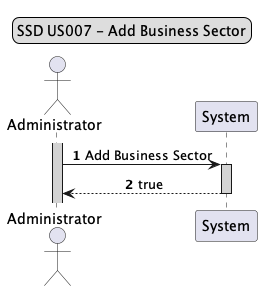
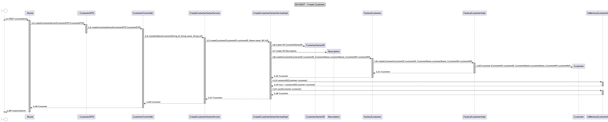
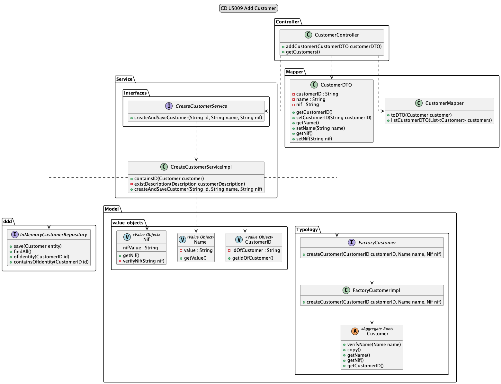

# US009 - As Administrator, I want to add a customer.

## 1. Requirements Engineering

### 1.1 User Story Description

As Administrator, I want to add a customer. For this, the actor will need to enter the customer's name.
The customer will be created and added to the list after verifying that it does not already exist.

### 1.2 Customer Specifications and Clarification

*From the specification document:*
*2.3.1 Register with the system*  
The system should choose to create the custom if all requested data is correctly filled in and if 
there is no custom with the same id or name.
- CustomerID
- Name
- Nif

Each project should have several pieces of information, one of which will be a customer.

*From client clarification:*
N/A

### 1.3 Acceptance Criteria
* Cannot have more than one customer with the same name.
* The name must be a maximum of 40 characters, including spaces.
* Cannot be created a typology without name.

### 1.4 Found out Dependencies

* n/a

### 1.5 Input and Output Data
*Input Data:*
* CustomerID
* Name
* Nif

*Output Data:*

* addedCustomer

### 1.6 Use Case Diagram (UCD)


### 1.7 System Sequence Diagram (SSD)



### 1.8 Other Relevant Remarks

* n/a

## 2. OO Analysis

### 2.1 Relevant Domain Model Excerpt


### 2.2 Other Remarks

* n/a

## 3. Design - User Story Realization


### 3.1 Sequence Diagram



### 3.2 Class Diagram



## 4. Tests

* *Success*

```java
 @Test
    void ensureCustomerIsAdded_ExpectTrue() {
        //Arrange
        String customerID0 = "costumer1";
        String name0 = "Adidas";
        String nif0 = "240606019";

        when(customer.getCustomerID()).thenReturn(customerID);
        when(customer.getName()).thenReturn(name);
        when(customer.getNif()).thenReturn(nif);

        when(customerID.getIdOfCustomer()).thenReturn(customerID0);
        when(name.getValue()).thenReturn(name0);
        when(nif.getNif()).thenReturn(nif0);

        CustomerDTO customerDTO = new CustomerDTO();
        customerDTO.setCustomerID(customerID0);
        customerDTO.setName(name0);
        customerDTO.setNif(nif0);

        when(createCustomerService.createAndSaveCustomer(customerID0, name0, nif0)).thenReturn(customer);

        ResponseEntity<Object> expected = new ResponseEntity<>(customerDTO, HttpStatus.CREATED);

        //ACT
        ResponseEntity<Object> result = customerController.addCustomer(customerDTO);

        //Assert
        assertEquals(expected, result);
    }
```

* *Fail*

```java
 @Test
    void ensureCustomerIsNotAddedDueToInvalidParameters_ExpectFalse() {
        //Arrange
        String customerID0 = null;
        String name0 = "Adidas";
        String nif0 = "240606019";

        when(customer.getCustomerID()).thenReturn(customerID);
        when(customer.getName()).thenReturn(name);
        when(customer.getNif()).thenReturn(nif);

        when(customerID.getIdOfCustomer()).thenReturn(customerID0);
        when(name.getValue()).thenReturn(name0);
        when(nif.getNif()).thenReturn(nif0);

        CustomerDTO customerDTO = new CustomerDTO();
        customerDTO.setCustomerID(customerID0);
        customerDTO.setName(name0);
        customerDTO.setNif(nif0);

        IllegalArgumentException exception = new IllegalArgumentException("Invalid parameters to add a Customer");

        when(createCustomerService.createAndSaveCustomer(customerID0, name0, nif0)).thenThrow(exception);

        //ACT
        ResponseEntity<Object> result = customerController.addCustomer(customerDTO);

        //Assert
        assertEquals(HttpStatus.BAD_REQUEST, result.getStatusCode());
        assertEquals(exception.getMessage(), result.getBody());
    }
```
## 5. Integration and Demo

* n/a

## 6. Observations

* n/a


