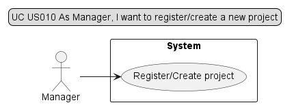
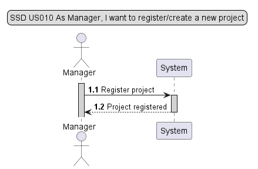
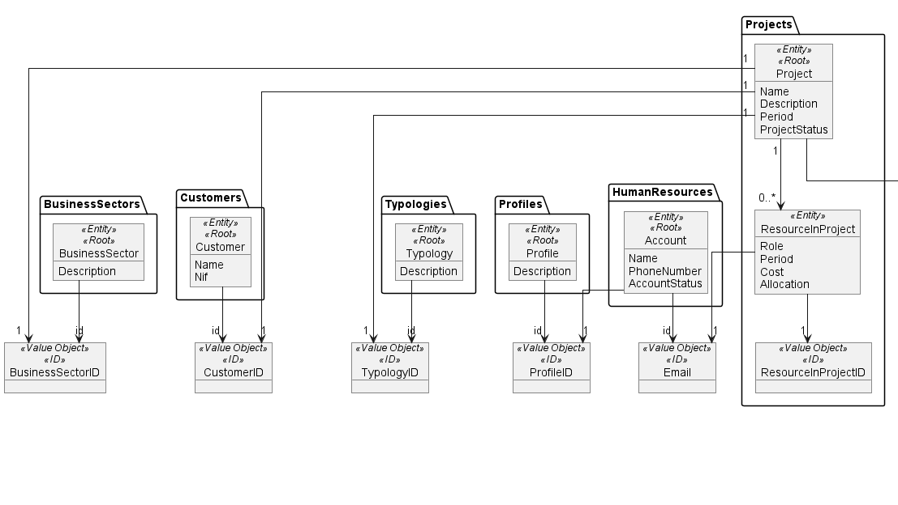
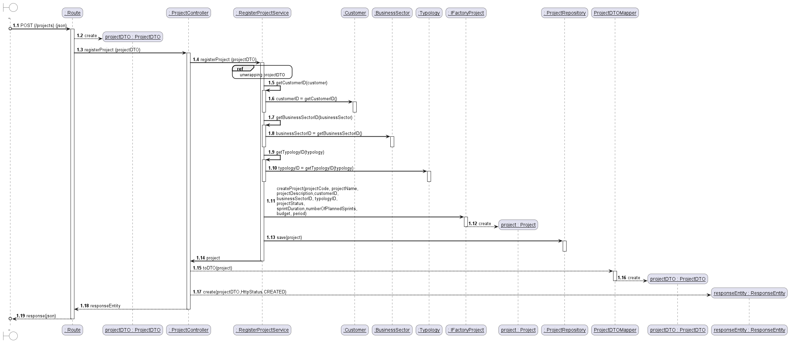
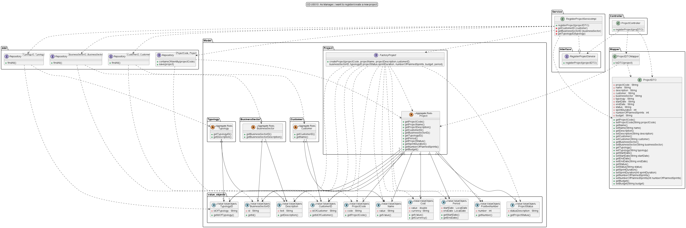

# US010 - As Manager, I want to register/create a new project

## 1. Requirements Engineering

### 1.1 User Story Description

For this user story, the actor will need to enter the project code, name and description. It will need to enter the customer name, business sector description and typology description has well.
The project will be registered and added to the list after verifying that it does not already exist.

### 1.2 Customer Specifications and Clarification

*From the specification document:*

The system should allow the registration of projects, the base entity that will serve for the association of activities and resources (users). Each project must have at least the following information:

* Code (unique alphanumerical identifier for each project);
* Project manager (user who will have the project manager profile for that record; may change over time);
* Name;
* Description;
* Start Date;
* Sprint duration (initial estimate);
* Number of planned sprints;
* End Date (when available, date it was closed);
* Customer;
* Business Sector;
* Typology (Fixed Cost / Time and materials);
* Product Owner (may change over time);
* Scrum Master (may change over time);
* Project team (may change over time);
* Project Status (Planned / Inception / Elaboration / Construction / Transition / Warranty / Closed);
* Budget (monetary amount available for resource spending).

The process of creating information relating to a project should be available exclusively for the Manager profile. However, the Project Manager should be able to edit part of the information.

*From client clarification:*

>Question: O que é essencial/mínimo para criar um projecto? Registar inclui guardar?
>
>
>
>Answer: A pergunta está formulada de uma forma estranha. Nem sequer percebo a segunda parte. Na dúvida, como PO não respondo.
>
>Answer: Mas é evidente que a US010 levanta a questão se o registo de um novo projeto é feito de uma vez só, ou se será efetuado por fazes. Por exemplo, faz sentido que a atribuição da equipa seja feita só quando o projeto esteja numa fase de execução, ou de planeamento da execução (Inception). Assim, vou colocar no canal Project uma clarificação sobre este assunto.
>
>Answer: Relativamente à US010, um projeto recém criado estará no estado "planned". Não terá recursos humanos associados.
Também não terá duração, start date, número de sprints e budget. Estes só serão definidos na fase de "inception".

### 1.3 Accepted Criteria
* Code (unique alphanumerical identifier for each project)
* A newly created Project will always be with the Project Status of "Planned"

### 1.4 Found out Dependencies
* In order to be able to add a customer, a business sector and a typology on the project register, the following dependencies where found:
    * US007 - As Administrator, I want to create a new project typology
    * US008 - As Administrator, I want to add a business sector
    * US009 - As Administrator, I want to add a customer

### 1.5 Input and Output Data

* Input Data:

    * Project code
    * Project name
    * Project description
    * Customer name
    * Business Sector description
    * Typology description
    * Sprint Duration
    * Number of planned sprints
    * Project start date
    * Project end date
    * Budget

* Output Data:

    * Project registered

### 1.6 Use Case Diagram (UCD)

### 1.7 System Sequence Diagram (SSD)

### 1.8 Other Relevant Remarks
* N/A

## 2. OO Analysis

### 2.1 Relevant Domain Model Excerpt

### 2.2 Other Remarks
* N/A

## 3. Design - User Story Realization

### 3.1 Rationale

| Interaction ID | US010       | Question: Which class is responsible for...                         | Answer                 | Justification                                                                                                 |
|----------------|-------------|---------------------------------------------------------------------|------------------------|---------------------------------------------------------------------------------------------------------------|
| Step 1         | SD 1.3      | ... interacting with the UI layer, and coordinating the user story? | ProjectController      | The Controller is responsible for receiving or handling a system operation to coordinate the user story       |
| Step 2         | SD 1.4/1.14 | ... interacting with the controller?                                | RegisterProjectService | Information Expert: have access to all repositories                                                           |
| Step 3         | SD 1.12     | ... creating a new project?                                         | FactoryProject         | Pure Fabrication: there is no reason to assign this responsibility to any existing class in the Domain Model  |
| Step 4         | SD 1.16     | ... creating a new projectDTO?                                      | ProjectDTOMapper       | Pure Fabrication: there is no reason to assign this responsibility to any existing class in the Domain Model  |
| Step 5         | SD 1.18     | ... providing data to the UI?                                       | ProjectController      | Controller: informs operation success                                                                         |

### 3.2 Sequence Diagram

### 3.3 Class Diagram

## 4. Tests

* *Success*
    * Ensure that a new Project is created with all the included information;
      

        @Test
        void ensureProjectIsRegistered() {
        //Arrange
        String projCode = "PRJ1";
        String projName = "E-commerce platform";
        String projDescription = "Update layout of website";
        String customerName = "c1";
        String businessSectorDescription = "bs1";
        String typologyDescription = "typ1";
        int durationOfSprint = 3;
        int numberOfSprints = 15;
        String projectStartDate = "2023-10-10";
        String projectEndDate = "2024-10-10";
        String projectBudget = "5000EUR";
        int value = 5000;
        String currency = "EUR";

        ProjectCode projectCode = new ProjectCode(projCode);
        Name projectName = new Name(projName);
        Description projectDescription = new Description(projDescription);
        ProjectStatus projectStatus = new ProjectStatus("planned");
        PositiveNumber sprintDuration = new PositiveNumber(durationOfSprint);
        PositiveNumber numberOfPlannedSprints = new PositiveNumber(numberOfSprints);
        Cost budget = new Cost(value, currency);

        when(projectDTO.getProjectCode()).thenReturn(projCode);
        when(projectDTO.getName()).thenReturn(projName);
        when(projectDTO.getDescription()).thenReturn(projDescription);
        when(projectDTO.getSprintDuration()).thenReturn(durationOfSprint);
        when(projectDTO.getNumberOfPlannedSprints()).thenReturn(numberOfSprints);
        when(projectDTO.getStartDate()).thenReturn(projectStartDate);
        when(projectDTO.getEndDate()).thenReturn(projectEndDate);
        when(projectDTO.getBudget()).thenReturn(projectBudget);

        LocalDate startDate = DateManagement.toLocalDate(projectStartDate);
        LocalDate endDate = DateManagement.toLocalDate(projectEndDate);

        Period period = new Period(startDate, endDate);

        when(projectDTO.getCustomer()).thenReturn(customerName);
        when(projectDTO.getBusinessSector()).thenReturn(businessSectorDescription);
        when(projectDTO.getTypology()).thenReturn(typologyDescription);

        List<Customer> customers = Collections.singletonList(customer);

        when(customerRepository.findAll()).thenReturn(customers);
        when(customer.getName()).thenReturn(name);
        when(name.getValue()).thenReturn(customerName);
        when(customer.getCustomerID()).thenReturn(customerID);

        List<BusinessSector> businessSectors = Collections.singletonList(businessSector);

        Description bsDescriptionDouble = mock(Description.class);

        when(businessSectorRepository.findAll()).thenReturn(businessSectors);
        when(businessSector.getBusinessSectorDescription()).thenReturn(bsDescriptionDouble);
        when(bsDescriptionDouble.getDescription()).thenReturn(businessSectorDescription);
        when(businessSector.getBusinessSectorID()).thenReturn(businessSectorID);

        Description typDescriptionDouble = mock(Description.class);

        List<Typology> typologies = Collections.singletonList(typology);

        when(typologyRepository.findAll()).thenReturn(typologies);
        when(typology.getDescription()).thenReturn(typDescriptionDouble);
        when(typDescriptionDouble.getDescription()).thenReturn(typologyDescription);
        when(typology.getTypologyID()).thenReturn(typologyID);

        when(factoryProject.createProject(projectCode, projectName, projectDescription, customerID,
                businessSectorID, typologyID, projectStatus, sprintDuration, numberOfPlannedSprints,
                budget, period)).thenReturn(project);

        when(projectRepository.containsOfIdentity(projectCode)).thenReturn(false);
        when(projectRepository.save(project)).thenReturn(project);

        Project expected = project;

        //Act
        Project result = registerProjectServiceImpl.registerProject(projectDTO);

        //Assert
        assertEquals(expected, result);
    }

* *Fail*
    * Ensure that the project we want to register is not registered in duplicate;
      
        
        @Test
        void ensureProjectIsNotRegistered_ProjectAlreadyExists() {
        //Arrange
        String projCode = "PRJ1";
        String projName = "E-commerce platform";
        String projDescription = "Update layout of website";
        String customerName = "c1";
        String businessSectorDescription = "bs1";
        String typologyDescription = "typ1";
        int durationOfSprint = 3;
        int numberOfSprints = 15;
        String projectStartDate = "2023-10-10";
        String projectEndDate = "";
        String projectBudget = "5000EUR";
        int value = 5000;
        String currency = "EUR";

        ProjectCode projectCode = new ProjectCode(projCode);
        Name projectName = new Name(projName);
        Description projectDescription = new Description(projDescription);
        ProjectStatus projectStatus = new ProjectStatus("planned");
        PositiveNumber sprintDuration = new PositiveNumber(durationOfSprint);
        PositiveNumber numberOfPlannedSprints = new PositiveNumber(numberOfSprints);
        Cost budget = new Cost(value, currency);

        when(projectDTO.getProjectCode()).thenReturn(projCode);
        when(projectDTO.getName()).thenReturn(projName);
        when(projectDTO.getDescription()).thenReturn(projDescription);
        when(projectDTO.getSprintDuration()).thenReturn(durationOfSprint);
        when(projectDTO.getNumberOfPlannedSprints()).thenReturn(numberOfSprints);
        when(projectDTO.getStartDate()).thenReturn(projectStartDate);
        when(projectDTO.getEndDate()).thenReturn(projectEndDate);
        when(projectDTO.getBudget()).thenReturn(projectBudget);

        LocalDate startDate = DateManagement.toLocalDate(projectStartDate);
        LocalDate endDate = startDate.plus(100, ChronoUnit.YEARS);

        Period period = new Period(startDate, endDate);

        when(projectDTO.getCustomer()).thenReturn(customerName);
        when(projectDTO.getBusinessSector()).thenReturn(businessSectorDescription);
        when(projectDTO.getTypology()).thenReturn(typologyDescription);

        List<Customer> customers = Collections.singletonList(customer);

        when(customerRepository.findAll()).thenReturn(customers);
        when(customer.getName()).thenReturn(name);
        when(name.getValue()).thenReturn(customerName);
        when(customer.getCustomerID()).thenReturn(customerID);

        List<BusinessSector> businessSectors = Collections.singletonList(businessSector);

        Description bsDescriptionDouble = mock(Description.class);

        when(businessSectorRepository.findAll()).thenReturn(businessSectors);
        when(businessSector.getBusinessSectorDescription()).thenReturn(bsDescriptionDouble);
        when(bsDescriptionDouble.getDescription()).thenReturn(businessSectorDescription);
        when(businessSector.getBusinessSectorID()).thenReturn(businessSectorID);

        Description typDescriptionDouble = mock(Description.class);

        List<Typology> typologies = Collections.singletonList(typology);

        when(typologyRepository.findAll()).thenReturn(typologies);
        when(typology.getDescription()).thenReturn(typDescriptionDouble);
        when(typDescriptionDouble.getDescription()).thenReturn(typologyDescription);
        when(typology.getTypologyID()).thenReturn(typologyID);

        when(factoryProject.createProject(projectCode, projectName, projectDescription, customerID,
                businessSectorID, typologyID, projectStatus, sprintDuration, numberOfPlannedSprints,
                budget, period)).thenReturn(project);

        when(projectRepository.containsOfIdentity(projectCode)).thenReturn(true);

        Throwable exception = assertThrows(IllegalArgumentException.class, () -> {
            registerProjectServiceImpl.registerProject(projectDTO);
        });
        //Assert
        assertEquals("Project already exists.", exception.getMessage());
    }

## 5. Integration and Demo
* N/A

## 6. Observations
* N/A