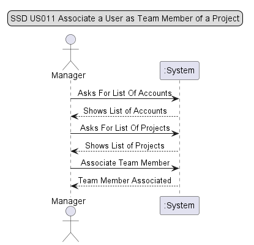
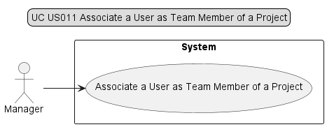
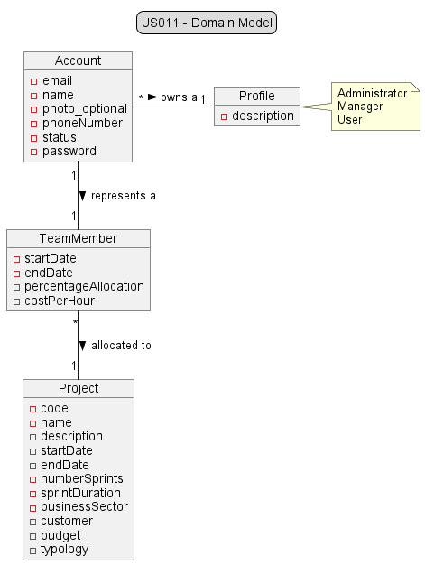
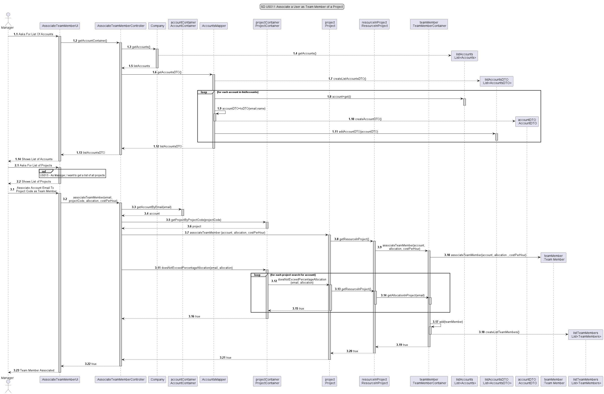
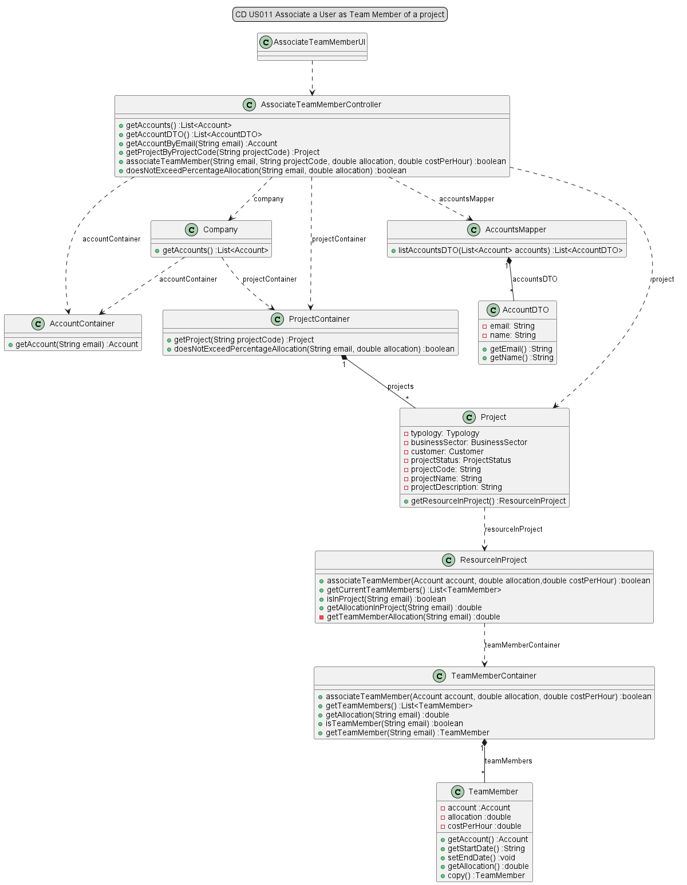

# US011 - As Manager, I want to associate a user as Team Member of a project.

## 1. Requirements Engineering

### 1.1 User Story Description

#### As Manager, I want to associate a user as Team Member of a project.

### 1.2 Customer Specifications and Clarification

*From the specification document:*
The Manager should have the ability to associate resources with projects. This association can
be made at the time of project creation or before each sprint. It is a scrum best practice that
no resource should be allocated to more than a project at a given time, so that developers are
focused on the tasks in hand. But this may not be feasible for specific technical and/or short
duration tasks.
When associating a resource with a project, the following information should be specified:
* Start date;
* End date;
* Cost per hour (monetary value that the resource costs for each hour used in the project);
* Percentage of allocation (100% for full-time, or the percentage corresponding to part-time);

The system should ensure that at no time (i.e. week) is a resource associated with an allocation
of more than 100% in different projects. You should also ensure that a resource is not associated
with project activities that go out of the allocation time they have set.

*From client clarification:*
>Question:
>"Devemos ter em consideração datas de início e fim que um recurso esteve alocado a um determinado projeto com um 
> determinado role, de modo a guardar o histórico dos recursos que trabalharam nesse projeto? Ou apenas uma lista com os recursos que um projeto contém no momento?" by Tiago Ribeiro
>> Answer: 
> "Manter o histórico é fundamental." by Ângelo Martins (PO)

>Question:  
> "Relativamente a estas user stories (US011, US012, US013), é suposto:
>* a) associar/alocar um utilizador a um projeto com os roles pretendidos (PO, Team Member, SM)?
>* b) mudar o role de um utilizador já previamente alocado a um projeto?
>* c) os dois?" by Margarida Ferreira
> >Answer:"Apenas associar a um projeto, tendo em atenção que não devem ser violadas regras do negócio." by Ângelo Martins (PO)

### 1.3 Accepted Criteria

### 1.4 Found out Dependencies

* In order to be able to add a resource to a project, the following dependencies where found:
    * "US010 - As Manager, I want to register/create a new project."

### 1.5 Input and Output Data

*Input Data:*

*Typed data:*
  * an email,
  * a project code,
  * a percentage allocation,
  * a cost per hour.

* *Selected data:*

* n/a

*Output Data:*
  * List of all accounts.
  * List of all projects.
  * (In)Success of the operation.

### 1.6 System Sequence Diagram (SSD)

### 1.7 Use Case Diagram (UCD)

### 1.8 Other Relevant Remarks

* n/a

## 2. OO Analysis

### 2.1 Relevant Domain Model Excerpt

### 2.2 Other Remarks

* n/a

## 3. Design - User Story Realization

### 3.1 Rationale

| Interaction ID | Question: Which class is responsible for... | Answer                        | Justification (with patterns)                                                                                 |
|----------------|---------------------------------------------|-------------------------------|---------------------------------------------------------------------------------------------------------------|
| Step 1         | ... interacting with the actor?             | AssociateTeamMemberUI         | Pure Fabrication: there is no reason to assign this responsibility to any existing class in the Domain Model. |
| Step 2         | ... coordinating the US?                    | AssociateTeamMemberController | Controller                                                                                                    |
| Step 3         | ... accessing the database?                 | ResourceInProject             | Information Expert                                                                                            |
| Step 4         | ... instantiating a new Team Member?        | TeamMemberContainer           | Creator                                                                                                       |
| Step 5         | ... validating the data locally?            | TeamMember                    | Knows its own data.                                                                                           |
|                | ... validating the data globally ?          | TeamMemberContainer           | Knows all TeamMember objects                                                                                  |
| Step 6         | ... saving the created Team Member ?        | TeamMemberContainer           | Saves all TeamMember objects                                                                                  |
| Step 7         | ... informing operation success?            | AssociateTeamMemberController | Controller return                                                                                             |
|                | ... informing operation success?            | DefineScrumMasterUI           | Responsible for user interaction                                                                              |

Conceptual classes promoted to software classes:

* n/a

Other software classes (i.e. Pure Fabrication) identified:

* n/a

### 3.2 Sequence Diagram

### 3.3 Class Diagram

## 4. Tests

* *Success*

* *Fail*

 

java
class ResourceInProject {...}

java
class TeamMember {...}

java
class TeamMemberContainer {...}

## 5. Integration and Demo

* n/a

## 6. Observations

* n/a

