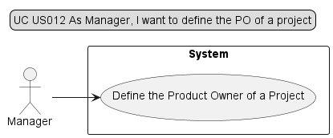
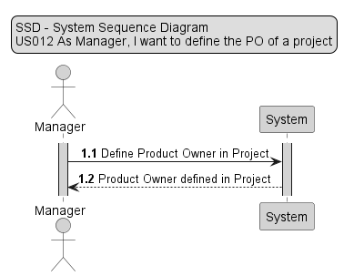
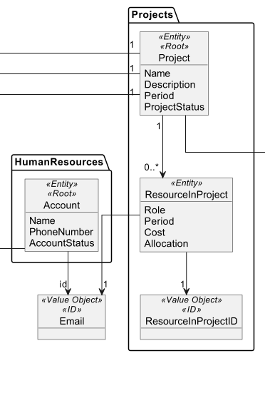
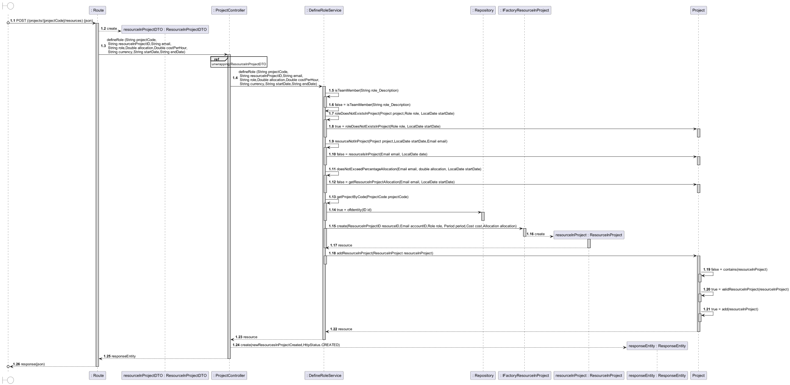
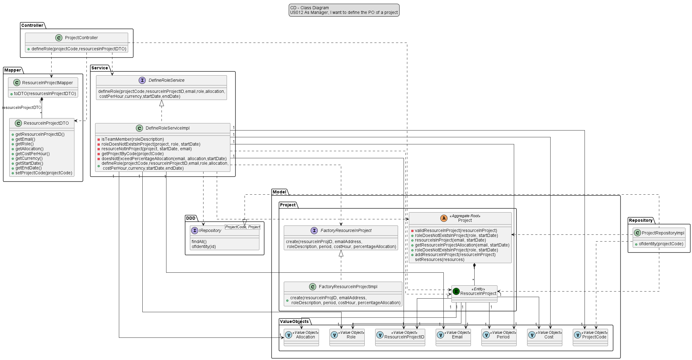

# US012 - As Manager, I want to define a Product Owner of a project.

## 1. Requirements Engineering

### 1.1 User Story Description

#### - As Manager, I want to define a Product Owner of a project -

The Manager logs into the project management tool and navigates to the project settings.
The Manager selects the option to define the Product Owner (PO) of the project.
The Manager is presented with a form where they can enter the details of the PO, such as their name, contact information,
and role in the project. Then fills in the required information and submits the form.
The project management tool saves the information and assigns the designated PO to the project.
After that the Manager verifies that the PO has been assigned correctly by checking the project dashboard and seeing the
PO's name and contact information displayed prominently.
Consequently the Manager communicates the PO assignment to the project team and stakeholders, ensuring that everyone is
aware of who to contact for product-related decisions and updates.
In this success scenario, the Manager successfully defines the PO for the project, ensuring that there is a clear point
of contact for all product-related matters. This helps to streamline communication and decision-making, ultimately
leading to a more efficient and effective project outcome.

### 1.2 Customer Specifications and Clarification

> *2.4.5 Pooling resources to projects*
>
> The Manager should have the ability to associate resources with projects. This association can
be made at the time of project creation or before each sprint. It is a scrum best practice that
no resource should be allocated to more than a project at a given time, so that developers are
focused on the tasks in hand. But this may not be feasible for specific technical and/or short
duration tasks.
When associating a resource with a project, the following information should be specified:
> * Start date;
> * End date;
> * Cost per hour (monetary value that the resource costs for each hour used in the project);
> * Percentage of allocation (100% for full-time, or the percentage corresponding to part-time);
>
> The system should ensure that at no time (i.e. week) is a resource associated with an allocation
of more than 100% in different projects. You should also ensure that a resource is not
associated with project activities that go out of the allocation time they have set.

*From client clarification:*
>Question:
>"Para as US 12 e 13, definimos o PO e SM a partir de Users que já estão alocados ao projeto ou adicionamos um novo User ao projeto com a função de PO ou SM?" by Diogo Sousa Luis
>
>
> >Answer:"O Product Owner nunca pode pertencer à equipa de desenvolvimento. O Scrum Master ainda pode ser, mas não é boa ideia. Team Member é um membro da equipa de desenvolvimento. É um papel como os outros.
Questão relevante seria: o que fazer quando se tentar atribuir a um utilizador, simultaneamente, o papel de PO e Team Member? Ou SM e PO?" by Ângelo Martins (PO)

>Question:
> "Relativamente a estas user stories (US011, US012, US013), é suposto:
a) associar/alocar um utilizador a um projeto com os roles pretendidos (PO, Team Member, SM)?
b) mudar o role de um utilizador já previamente alocado a um projeto?
c) os dois?" by Margarida Ferreira
> >Answer:"Apenas associar a um projeto, tendo em atenção que não devem ser violadas regras do negócio." by Ângelo Martins (PO)

>Question:
>"Devemos ter em consideração datas de início e fim que um recurso esteve alocado a um determinado projeto com um determinado role, de modo a guardar o histórico dos recursos que trabalharam nesse projeto? Ou apenas uma lista com os recursos que um projeto contém no momento?" by Tiago Ribeiro
> >Answer:"Manter o histórico é fundamental." by Ângelo Martins (PO)

### 1.3 Accepted Criteria

*  ID (unique alphanumerical identifier for each product owner)
*  Allocation cannot be more than 100%
*  Each person cannot have two roles at the same time in project
*  Only one product owner at the same time in project

### 1.4 Found out Dependencies

* In order to be able to add a resource to a project, the following dependencies where found:
    * *US010* - "As Manager, I want to register/create a new project."

### 1.5 Input and Output Data

* *Input Data:*
    * a project code;
    * a resourceInProjectID
    * an email;
    * a role
    * a percentage of allocation;
    * a cost per hour.
    * period

* *Output Data:*
  * (In)Success of the operation.

### 1.6 Design

### 1.6.1 Use Case Diagram (UCD)

### 1.6.2 System Sequence Diagram (SSD)

## 2. OO Analysis

### 2.1 Relevant Domain Model Excerpt

## 3. Design - User Story Realization

### 3.1 Rationale

| Interaction ID | US010       | Question: Which class is responsible for...                         | Answer                   | Justification                                                                                                 |
|----------------|-------------|---------------------------------------------------------------------|--------------------------|---------------------------------------------------------------------------------------------------------------|
| Step 1         | SD 1.3      | ... interacting with the UI layer, and coordinating the user story? | ProjectController        | The Controller is responsible for receiving or handling a system operation to coordinate the user story       |
| Step 2         | SD 1.4/1.23 | ... interacting with the controller?                                | DefineRoleService        | Information Expert: have access to all repositories                                                           |
| Step 3         | SD 1.16     | ... defining a new Role in a Project?                               | FactoryResourceInProject | Pure Fabrication: there is no reason to assign this responsibility to any existing class in the Domain Model  |
| Step 4         | SD 1.25     | ... providing data to the UI?                                       | ProjectController        | Controller: informs operation success                                                                         |

### 3.2 Sequence Diagram

### 3.3 Class Diagram

## 4. Tests

* *Success*
* Ensure that the ProductOwner is definied with all the included information;
  
        @Test
        void ensureDefineScrumMasterRole() {
        //Arrange
        String projCode = "PRJ1";
        String resourceInProjID = "resource1";
        String emailAddress = "test@gmail.com";
        String roleDescription = "scrum master";
        double percentageAllocation = 20.0;
        double cost = 20.0;
        String currency = "EUR";
        String roleStartDate = "2023-10-09";
        String roleEndDate = "2024-10-09";

        ProjectCode projectCode = new ProjectCode(projCode);
        ResourceInProjectID resourceInProjectID = new ResourceInProjectID(resourceInProjID);
        Email email = new Email(emailAddress);
        Role role = new Role(roleDescription);

        DateTimeFormatter format = DateTimeFormatter.ofPattern("yyyy-MM-dd");
        LocalDate startDate = LocalDate.parse(roleStartDate, format);
        LocalDate endDate = LocalDate.parse(roleEndDate, format);

        Period period = new Period(startDate, endDate);
        Cost costPerHour = new Cost(cost, currency);
        Allocation allocation = new Allocation(percentageAllocation);

        when(projectRepository.ofIdentity(projectCode)).thenReturn(optionalProject);

        when(optionalProject.isPresent()).thenReturn(true);

        when(optionalProject.get()).thenReturn(project);

        when(project.roleDoesNotExistsInProject(role, startDate)).thenReturn(true);

        when(project.resourceIsInProject(email, startDate)).thenReturn(false);

        List<Project> projects = Arrays.asList(project);

        when(projectRepository.findAll()).thenReturn(projects);

        when(project.getResourceInProjectAllocation(email, startDate)).thenReturn(70.0);

        when(factoryResourceInProject.create(resourceInProjectID, email, role, period, costPerHour, allocation))
                .thenReturn(resourceInProject);

        when(project.addResourceInProject(resourceInProject)).thenReturn(true);

        ResourceInProject expected = resourceInProject;
        //Act
        ResourceInProject result = defineRoleServiceImpl.defineRole(
                projCode,
                resourceInProjID,
                emailAddress,
                roleDescription,
                percentageAllocation,
                cost,
                currency,
                roleStartDate,
                roleEndDate);
        //Assert
        assertEquals(expected, result);
       }

* *Fail*
* Ensure that the ProductOwner is not definied because the account is already with other role in that same project;

         @Test
         void ensureDoNotDefineScrumMasterRole_resourceAlreadyInProject() {
         //Arrange
         String projCode = "PRJ1";
         String resourceInProjID = "resource1";
         String emailAddress = "test@gmail.com";
         String roleDescription = "scrum master";
         double percentageAllocation = 20.0;
         double cost = 20.0;
         String currency = "EUR";
         String roleStartDate = "2023-10-09";
         String roleEndDate = "2024-10-09";

          ProjectCode projectCode = new ProjectCode(projCode);
          Email email = new Email(emailAddress);
          Role role = new Role(roleDescription);

          DateTimeFormatter format = DateTimeFormatter.ofPattern("yyyy-MM-dd");
          LocalDate startDate = LocalDate.parse(roleStartDate, format);

          when(projectRepository.ofIdentity(projectCode)).thenReturn(optionalProject);

          when(optionalProject.isPresent()).thenReturn(true);

          when(optionalProject.get()).thenReturn(project);

          when(project.roleDoesNotExistsInProject(role, startDate)).thenReturn(true);

          when(project.resourceIsInProject(email, startDate)).thenReturn(true);

          //Act
          Throwable exception = assertThrows(IllegalArgumentException.class, () -> {
              defineRoleServiceImpl.defineRole(
                      projCode,
                      resourceInProjID,
                      emailAddress,
                      roleDescription,
                      percentageAllocation,
                      cost,
                      currency,
                      roleStartDate,
                      roleEndDate);
          });
          //Assert
          assertEquals("Resource in Project not created",exception.getMessage());
      }

## 6. Observations

Overall, US012 aims to ensure that there is a clear point of contact for all product-related matters, which helps to 
streamline communication and decision-making, leading to a more efficient and effective project outcome.