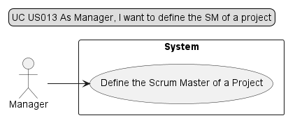
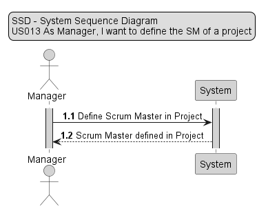
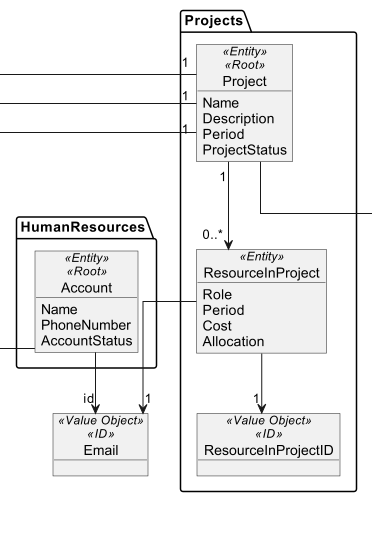
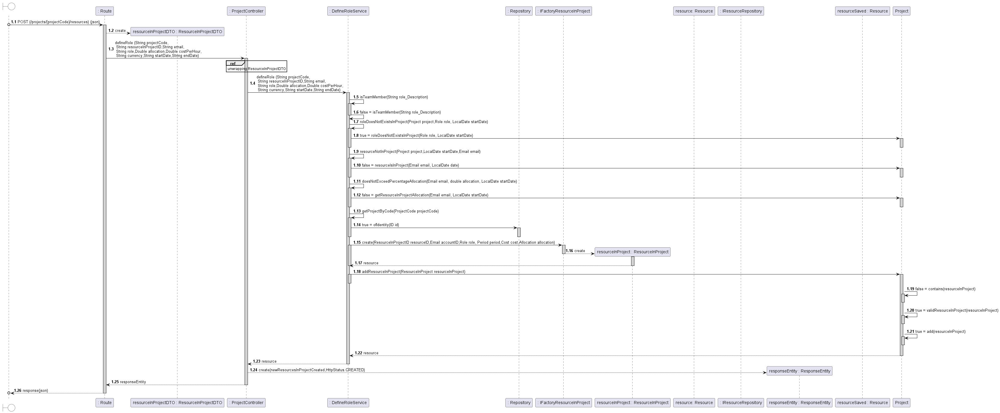
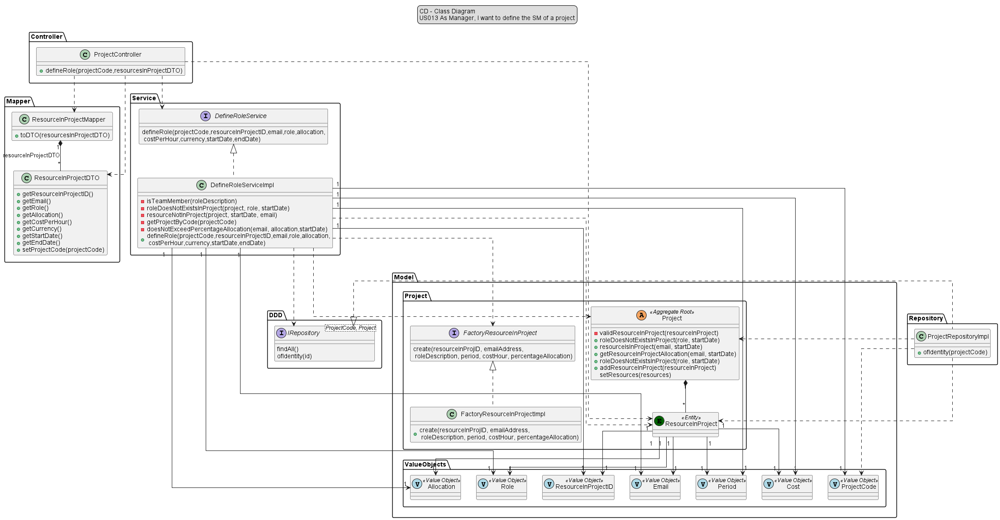

# US013 - As Manager, I want to define the SM of a project

## 1. Requirements Engineering

### 1.1 User Story Description

#### As Manager, I want to define the SM of a project
For the Manager be able to define a scrum master in a project, he needs to know what project and what account 
it's going to be used. After that he has to input some data like project code, email, role ,percentage of allocation and cost 
per hour. 

### 1.2 Customer Specifications and Clarification

*From the specification document:*
> *2.4.5 Pooling resources to projects*
>
> The Manager should have the ability to associate resources with projects. This association can
> be made at the time of project creation or before each sprint. It is a scrum best practice that
> no resource should be allocated to more than a project at a given time, so that developers are
> focused on the tasks in hand. But this may not be feasible for specific technical and/or short
> duration tasks.
> When associating a resource with a project, the following information should be specified:
> * Start date;
> * End date;
> * Cost per hour (monetary value that the resource costs for each hour used in the project);
> * Percentage of allocation (100% for full-time, or the percentage corresponding to part-time);
>
> The system should ensure that at no time (i.e. week) is a resource associated with an allocation
> of more than 100% in different projects. You should also ensure that a resource is not
> associated with project activities that go out of the allocation time they have set.

*From client clarification:*
> *Question:*  
> Para as US 12 e 13, definimos o PO e SM a partir de Users que já estão alocados ao projeto ou adicionamos
> um novo User ao projeto com a função de PO ou SM?
>
>*Answer:*  
> Peço desculpa pela frontalidade, mas essa questão ilustra alguma ignorância sobre o scrum.   
> Quando se está a desenvolver um projeto numa dada área uma pessoa deve tentar informar-se sobre essa mesma área.    
> Mais uma vez, é essencial que leiam pelo menos o Scrum Guide (link em LABPROJ1 ou pesquisem em scrum.org).  
> Mas recomendo o livro do Jeff Sutherland "Scrum: The Art of Doing Twice the Work in Half the Time".  
> O Product Owner nunca pode pertencer à equipa de desenvolvimento. O Scrum Master ainda pode ser, mas não é boa
> ideia.   
> Team Member é um membro da equipa de desenvolvimento. É um papel como os outros.
>
>*Question:*  
> Relativamente a estas user stories (US011, US012, US013), é suposto:  
> a) associar/alocar um utilizador a um projeto com os roles pretendidos (PO, Team Member, SM)?  
> b) mudar o role de um utilizador já previamente alocado a um projeto?  
> c) os dois?
>
>*Answer:*  
> Apenas associar a um projeto, tendo em atenção que não devem ser violadas regras do negócio.
>
>*Question:*  
> Devemos ter em consideração datas de início e fim que um recurso esteve alocado a um determinado projeto
> com um determinado role, de modo a guardar o histórico dos recursos que trabalharam nesse projeto?   
> Ou apenas uma lista com os recursos que um projeto contém no momento?
>
>*Answer:*  
> Manter o histórico é fundamental.
>
>*Question:*  
> Participação dentro do projecto só para user?
>
>*Answer:*   
> Lamento, mas não vou responder às restantes perguntas por entender que não estão bem
> formuladas ou não se dirigem ao PO.

### 1.3 Accepted Criteria

*  ID (unique alphanumerical identifier for each scrum master)
*  Allocation cannot be more than 100%
*  Each person cannot have two roles at the same time in the project
*  Only one scrum master at the same time in project

### 1.4 Found out Dependencies

* In order to be able to add a resource to a project, the following dependencies where found:
    * *US010* - As Manager, I want to register/create a new project.

### 1.5 Input and Output Data

* *Input Data:*
    * a project code,
    * an email, 
    * a role
    * a percentage of allocation,
    * a cost per hour.
    * period

* *Output Data:*
    * (In)Success of the operation.

### 1.6 Use-Case Diagram (UCD)

### 1.7 System Sequence Diagram (SSD)

## 2. OO Analysis

### 2.1 Relevant Domain Model Excerpt

## 3. Design - User Story Realization

### 3.1 Rationale

| Interaction ID | US010       | Question: Which class is responsible for...                         | Answer                   | Justification                                                                                                 |
|----------------|-------------|---------------------------------------------------------------------|--------------------------|---------------------------------------------------------------------------------------------------------------|
| Step 1         | SD 1.3      | ... interacting with the UI layer, and coordinating the user story? | ProjectController        | The Controller is responsible for receiving or handling a system operation to coordinate the user story       |
| Step 2         | SD 1.4/1.23 | ... interacting with the controller?                                | DefineRoleService        | Information Expert: have access to all repositories                                                           |
| Step 3         | SD 1.16     | ... defining a new Role in a Project?                               | FactoryResourceInProject | Pure Fabrication: there is no reason to assign this responsibility to any existing class in the Domain Model  |
| Step 4         | SD 1.25     | ... providing data to the UI?                                       | ProjectController        | Controller: informs operation success                                                                         |

### 3.2 Sequence Diagram

### 3.3 Class Diagram

## 4. Tests

* *Success*
* Ensure that the Scrum Master is definied with all the included information;

        @Test
        void ensureDefineScrumMasterRole() {
        //Arrange
        String projCode = "PRJ1";
        String resourceInProjID = "resource1";
        String emailAddress = "test@gmail.com";
        String roleDescription = "scrum master";
        double percentageAllocation = 20.0;
        double cost = 20.0;
        String currency = "EUR";
        String roleStartDate = "2023-10-09";
        String roleEndDate = "2024-10-09";

        ProjectCode projectCode = new ProjectCode(projCode);
        ResourceInProjectID resourceInProjectID = new ResourceInProjectID(resourceInProjID);
        Email email = new Email(emailAddress);
        Role role = new Role(roleDescription);

        DateTimeFormatter format = DateTimeFormatter.ofPattern("yyyy-MM-dd");
        LocalDate startDate = LocalDate.parse(roleStartDate, format);
        LocalDate endDate = LocalDate.parse(roleEndDate, format);

        Period period = new Period(startDate, endDate);
        Cost costPerHour = new Cost(cost, currency);
        Allocation allocation = new Allocation(percentageAllocation);

        when(projectRepository.ofIdentity(projectCode)).thenReturn(optionalProject);

        when(optionalProject.isPresent()).thenReturn(true);

        when(optionalProject.get()).thenReturn(project);

        when(project.roleDoesNotExistsInProject(role, startDate)).thenReturn(true);

        when(project.resourceIsInProject(email, startDate)).thenReturn(false);

        List<Project> projects = Arrays.asList(project);

        when(projectRepository.findAll()).thenReturn(projects);

        when(project.getResourceInProjectAllocation(email, startDate)).thenReturn(70.0);

        when(factoryResourceInProject.create(resourceInProjectID, email, role, period, costPerHour, allocation))
                .thenReturn(resourceInProject);

        when(project.addResourceInProject(resourceInProject)).thenReturn(true);

        ResourceInProject expected = resourceInProject;
        //Act
        ResourceInProject result = defineRoleServiceImpl.defineRole(
                projCode,
                resourceInProjID,
                emailAddress,
                roleDescription,
                percentageAllocation,
                cost,
                currency,
                roleStartDate,
                roleEndDate);
        //Assert
        assertEquals(expected, result);
       }

* *Fail*
* Ensure that the Scrum Master is not definied because the account is already with other role in that same project;

         @Test
         void ensureDoNotDefineScrumMasterRole_resourceAlreadyInProject() {
         //Arrange
         String projCode = "PRJ1";
         String resourceInProjID = "resource1";
         String emailAddress = "test@gmail.com";
         String roleDescription = "scrum master";
         double percentageAllocation = 20.0;
         double cost = 20.0;
         String currency = "EUR";
         String roleStartDate = "2023-10-09";
         String roleEndDate = "2024-10-09";

          ProjectCode projectCode = new ProjectCode(projCode);
          Email email = new Email(emailAddress);
          Role role = new Role(roleDescription);

          DateTimeFormatter format = DateTimeFormatter.ofPattern("yyyy-MM-dd");
          LocalDate startDate = LocalDate.parse(roleStartDate, format);

          when(projectRepository.ofIdentity(projectCode)).thenReturn(optionalProject);

          when(optionalProject.isPresent()).thenReturn(true);

          when(optionalProject.get()).thenReturn(project);

          when(project.roleDoesNotExistsInProject(role, startDate)).thenReturn(true);

          when(project.resourceIsInProject(email, startDate)).thenReturn(true);

          //Act
          Throwable exception = assertThrows(IllegalArgumentException.class, () -> {
              defineRoleServiceImpl.defineRole(
                      projCode,
                      resourceInProjID,
                      emailAddress,
                      roleDescription,
                      percentageAllocation,
                      cost,
                      currency,
                      roleStartDate,
                      roleEndDate);
          });
          //Assert
          assertEquals("Resource in Project not created",exception.getMessage());
      }

