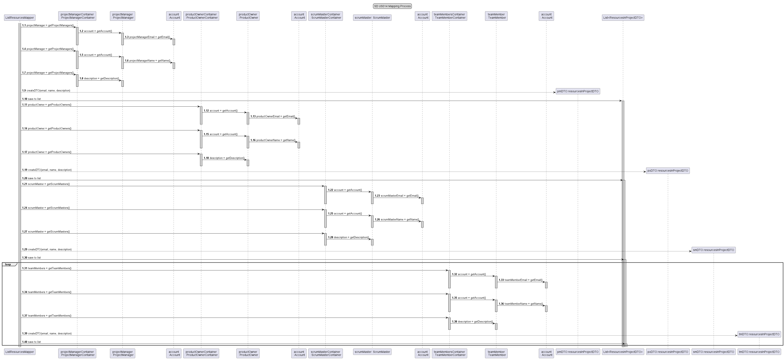

# US014 - As Manager, I want to get a list of all human resources in a project

## 1. Requirements Engineering

### 1.1 User Story Description

#### As Manager, I want to get a list of all human resources in a project.

For this user story, the actor (Manager) will need to get a list of all projects, so he can know a project code for a 
specific project. Then with that code he will ask to list the resources allocated to that specific project.

Using a mapping process, I will make dto's objects with the information I want to list, in this case
only the account email, name and role of all accounts allocated to the project I want to list.

### 1.2 Customer Specifications and Clarification

>*From the specification document:*

*2.1 USER PROFILES AND ROLES*

The Manager is a profile that allows the user to access all projects and manage
resources. A Manager doesn’t participate in projects

*2.4.1 Project Registration*

The process of creating information relating to a project should be available
exclusively for the Manager profile. However, the Project Manager should be able
to edit part of the information.

*2.4.2 Project Search*

The Manager is the only profile that has access to all projects.

>*From client clarification:*

Question: Devemos ter em consideração datas de início e fim que um recurso esteve alocado 
a um determinado projeto com um determinado role, de modo a guardar o histórico dos recursos 
que trabalharam nesse projeto? Ou apenas uma lista com os recursos que um projeto contém no 
momento?

Answer: Manter o histórico é fundamental.

### 1.3 Acceptance Criteria

Not yet given, or defined

### 1.4 Found out Dependencies

* In order to be able to list all the human resources of a project, the following
  dependencies where found:
    * *US010* "As Manager, I want to register/create a new project."
    * *US011* "As Manager, I want to associate a user as Team Member of a project."
    * *US012* "As Manager, I want to define the PO of a project."
    * *US013* "As Manager, I want to define the SM of a project."

### 1.5 Input and Output Data

*Input Data:*

* a project code.
* a resource in project.

*Output Data:*

* List of all human resources of a project.
* (In)Success of the operation.

### 1.6 Use-Case Diagram (UCD)

### 1.7 System Sequence Diagram (SSD)

### 1.8 Other Relevant Remarks

n/a

## 2. OO Analysis
### 2.1 Relevant Domain Model Excerpt

### 2.2 Other Remarks

n/a

## 3. Design - User Story Realization

### 3.1 Rationale

| Interaction ID | Question: Which class is responsible for... | Answer                     | Justification (with patterns)                                                                                   |
|----------------|-------------------------------------------|----------------------------|-----------------------------------------------------------------------------------------------------------------|
| Step 1         | ... interacting with the actor?           | ListResourcesUI            | Pure fabrication: collecting data from the user                                                                 |
|                | ... coordinating the US?                  | ListAllResourcesController | Controller : coordinating and distributing the actions performed on  the User Interface to the domain layer |
|                | ... has the data containers?              | Company                    | Information Expert: knows/has all Containers                                                                    |
|                | ... knowing the database?                 | ProjectContainer           | Information Expert: knows/has all Projects                                                                      |
|                | ... shows the data?                       | Project                    | Information Expert: knows its own data                                                                          |
|                | ... shows the data?                       | ResourceInProject          | Information Expert: knows/has all Containers                                                                    |
|                | ... shows the data?                       | ProjectManagerContainer    | Information Expert: knows/has all Project Managers                                                              |
|                | ... shows the data?                       | ProjectOwnerContainer      | Information Expert: knows/has all Project Owners                                                                |
|                | ... shows the data?                       | ScrumMasterContainer       | Information Expert: knows/has all Scrum Masters                                                                 |
|                | ... shows the data?                       | TeamMemberContainer        | Information Expert: knows/has all Team Members                                                                  |
|                | ... shows the data?                       | ProjectManager             | Information Expert: knows its own data and all Accounts                                                         |
|                | ... shows the data?                       | ProductOwner               | Information Expert: knows its own data and all Accounts                                                                          |
|                | ... shows the data?                       | ScrumMaster                | Information Expert: knows its own data and all Accounts                                                                          |
|                | ... shows the data?                       | TeamMember                 | Information Expert: knows its own data and all Accounts                                                                          |
|                | ... shows the data?                       | Account                    | Information Expert: knows its own data                                                                          |
| Step 2         | ... present the project list?             | UI                         | Information Expert: responsible for user interaction                                                            |

### 3.2 Sequence Diagram

*Mapping Process (Creation of DTO's and save them to a list)*

### 3.3 Class Diagram

## 4. Tests

* *Success*
    * ensureResourcesAreAddedToListCorrectly_Success()

* *Fail*
    * ensureResourcesAreAddedToListIncorrectly_createdADifferentAccount()

  * ensureThatAreNoTeamMembers_Null_Success()

java
class ResourcesInProjectMapper {...}

## 5. Integration and Demo

n/a

## 6. Observations

n/a