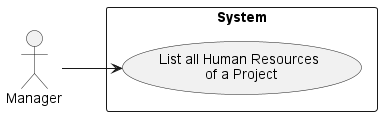
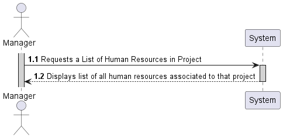
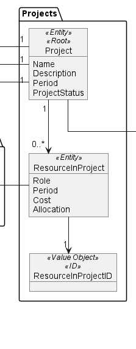
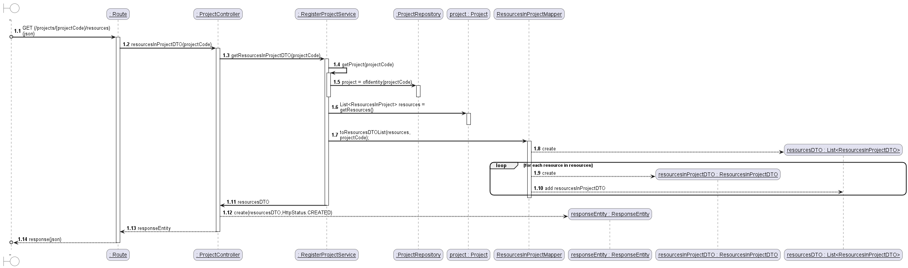
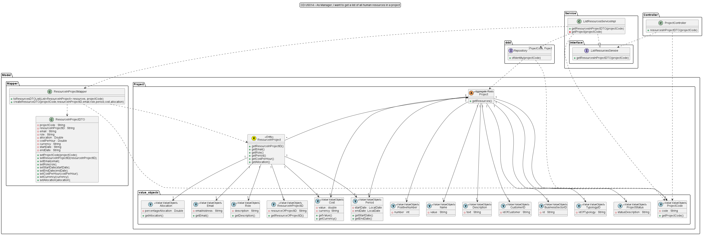

# US014 - As Manager, I want to get a list of all human resources in a project

## 1. Requirements Engineering

### 1.1 User Story Description

#### As Manager, I want to get a list of all human resources in a project.

For this user story, the actor (Manager) will need to get a list of all projects, so he can know a project code for a
specific project. Then with that code he will ask to list the resources allocated to that specific project.

Using a mapping process, I will make dto's objects with the information I want to list, in this case
only the account email, name and role of all accounts allocated to the project I want to list.

### 1.2 Customer Specifications and Clarification

>*From the specification document:*

*2.1 USER PROFILES AND ROLES*

The Manager is a profile that allows the user to access all projects and manage
resources. A Manager doesn’t participate in projects

*2.4.1 Project Registration*

The process of creating information relating to a project should be available
exclusively for the Manager profile. However, the Project Manager should be able
to edit part of the information.

*2.4.2 Project Search*

The Manager is the only profile that has access to all projects.

>*From client clarification:*

Question: Devemos ter em consideração datas de início e fim que um recurso esteve alocado
a um determinado projeto com um determinado role, de modo a guardar o histórico dos recursos
que trabalharam nesse projeto? Ou apenas uma lista com os recursos que um projeto contém no
momento?

Answer: Manter o histórico é fundamental.

### 1.3 Acceptance Criteria

Not yet given, or defined

### 1.4 Found out Dependencies

* In order to be able to list all the human resources of a project, the following
  dependencies where found:
    * *US010* "As Manager, I want to register/create a new project."
    * *US011* "As Manager, I want to associate a user as Team Member of a project."
    * *US012* "As Manager, I want to define the PO of a project."
    * *US013* "As Manager, I want to define the SM of a project."

### 1.5 Input and Output Data

*Input Data:*

* a project code.

*Output Data:*

* List of all human resources of a project.

### 1.6 Use-Case Diagram (UCD)

### 1.7 System Sequence Diagram (SSD)

### 1.8 Other Relevant Remarks

n/a

## 2. OO Analysis
### 2.1 Relevant Domain Model Excerpt

### 2.2 Other Remarks

n/a

## 3. Design - User Story Realization

### 3.1 Rationale

| Interaction ID | Question: Which class is responsible for...                         | Answer                   | Justification (with patterns)                                                                                |
|----------------|---------------------------------------------------------------------|--------------------------|--------------------------------------------------------------------------------------------------------------|
| Step 1         | ... interacting with the UI layer, and coordinating the user story? | ProjectController        | The Controller is responsible for receiving or handling a system operation to coordinate the user story      |
| Step 2         | ... interacting with the controller?                                | ListResourcesService     | Information Expert: have access to all repositories                                                          |
| Step 3         | ... knowing the database?                                           | ProjectRepository        | Information Expert: knows/has all Projects                                                                   |
| Step 4         | ... showing the data?                                               | Project                  | Information Expert: knows its own data                                                                       |
| Step 5         | ... creating a list of human resources DTO                          | ResourcesInProjectMapper | Pure Fabrication: there is no reason to assign this responsibility to any existing class in the Domain Model |                                                                     |
| Step 6         | ... providing data to the UI?                                       | ProjectController        | Controller: informs operation success                                                                        |

### 3.2 Sequence Diagram

*Mapping Process (Creation of DTO's and save them to a list)*

### 3.3 Class Diagram

## 4. Tests

* *Success*
    * ensure get list of resources in project

      
      @Test
      void ensureGetListOfResourcesInProjectDTO() {
        //Arrange
        Optional<Project> optionalDouble = mock(Optional.class);
        Project projectDouble = mock(Project.class);
        String projCode = "PRJ1";
        ProjectCode projectCode=new ProjectCode(projCode);

        ResourcesInProjectDTO resourcesInProjectDTODouble = mock(ResourcesInProjectDTO.class);
        List<ResourcesInProjectDTO> resourcesInProjectDTOS = Collections.singletonList(resourcesInProjectDTODouble);

        ResourceInProject resourceInProjectDouble = mock(ResourceInProject.class);
        List<ResourceInProject> resources = Collections.singletonList(resourceInProjectDouble);

        when(projectRepository.ofIdentity(projectCode)).thenReturn(optionalDouble);
        when(optionalDouble.isPresent()).thenReturn(true);
        when(optionalDouble.get()).thenReturn(projectDouble);

        when(projectDouble.getResources()).thenReturn(resources);

        List<ResourcesInProjectDTO> expected = Arrays.asList(resourcesInProjectDTODouble);

        try (MockedStatic<ResourcesInProjectMapper> mapperDouble = Mockito.mockStatic(ResourcesInProjectMapper.class)) {
            mapperDouble.when(() -> ResourcesInProjectMapper.toResourcesDTOList(resources,projectCode)).thenReturn(resourcesInProjectDTOS);

            //Act
            List<ResourcesInProjectDTO> result = listResourcesService.getResourcesInProjectDTO(projCode);
            //Assert
            assertEquals(expected, result);
        }
    }

* *Fail*
    * ensure get empty list of resources in project - project does not exist:

    @Test
    void ensureGetEmptyListOfResourcesInProjectDTO_projectNotFound() {
        //Arrange
        Optional<Project> optionalDouble = mock(Optional.class);
        String projectCode = "PRJ1";
        ProjectCode projectCode_vo=mock(ProjectCode.class);

        when(projectRepository.ofIdentity(projectCode_vo)).thenReturn(optionalDouble);
        when(optionalDouble.isPresent()).thenReturn(false);

        Throwable exception = assertThrows(IllegalStateException.class, () -> {
            listResourcesService.getResourcesInProjectDTO(projectCode);
        });
            //Assert
            assertEquals("Project does not exists", exception.getMessage());
        }

* *Fail*
  * ensure get exception - project code invalid:

  
    @Test
    void ListResources_FailedBecauseInvalidInputs() {
        //Arrange
        String projectCode = "";

        Throwable exception = assertThrows(IllegalArgumentException.class, () -> {
            listResourcesService.getResourcesInProjectDTO(projectCode);
        });
        //Assert
        assertEquals("Project code cannot be empty", exception.getMessage());
    }

## 5. Integration and Demo

n/a

## 6. Observations

n/a