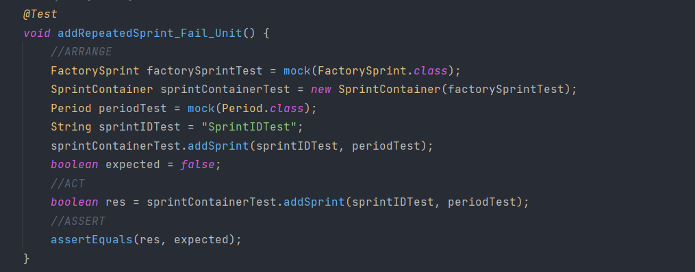

# US019 - As Project Manager, I want to create a sprint

## 1. Requirements Engineering

### 1.1 User Story Description

#### As Project Manager, I want to create a sprint

In order to create a sprint in a project the Project Manager needs to know what project is going to be used.
After that he has to input some data like project code, sprintID amd duration of the sprint.

### 1.2 Customer Specifications and Clarification

From the specification document:

> *2.4.3 Record of activities of a project*
>
> The project timeline is divided into sprints (multiple of weeks), typically of a predefined
> duration, and the project team, the PO and the SM don’t change during the sprint.
> Each sprint has a “sprint backlog”, i.e., the set of US that should be addressed during the
> sprint.

2.4.7 Allocations report

> Question:
>
> "Boa tarde Angelo Martins, em relação US019 quais ou atributos necessários para a criação da Sprint? Sprint number,
> start date e project code?"  (asked by Cristiana Azevedo Moreira)

> Answer:
>
> n/a

### 1.3 Accepted Criteria

* Each Sprint has a unique SprintID.

### 1.4 Found out Dependencies

* In order to be able to create a sprint, the following dependencies where found:
    * *US010* As Manager, I want to register/create a new project.

### 1.5 Input and Output Data

*Input Data:*

* Project Code
* SprintID
* Period

*Output Data:*

* (In)Success of the operation.

### 1.6 Use-Case Diagram (UCD)

[UC019_CreateSprint.puml](UC019_CreateSprint.puml)

### 1.7 System Sequence Diagram (SSD)

[SSD019_CreateSprint.puml](SSD019_CreateSprint.puml)

### 1.8 Other Relevant Remarks

n/a

## 2. OO Analysis

### 2.1 Relevant Domain Model Excerpt

[RelevantDomainModel.puml](RelevantDomainModel.puml)

### 2.2 Other Remarks

n/a

## 3. Design - User Story Realization

### 3.1 Rationale

| Interaction ID | Question: Which class is responsible for...                         | Answer           | Justification      |
|----------------|---------------------------------------------------------------------|------------------|--------------------|
| Step 1         | ... interacting with the actor?                                     | SprintUI         | Pure Fabrication   |
| Step 2         | ... interacting with the UI layer, and coordinating the user story? | SprintController | Controller         |
| Step 3         | ... accessing to all the projects ?                                 | ProjectContainer | Information Expert |
| Step 4         | ... accessing the sprint container?                                 | Project          | Information Expert |
| Step 5         | ... accessing to all of the sprints during a project ?              | SprintContainer  | Information Expert |
| Step 6         | ... creating the sprint ?                                           | FactorySprint    | Creator            |
| Step 7         | ... providing data to the Actor?                                    | SprintUI         | Pure Fabrication   |

### 3.2 Sequence Diagram

[SD019_CreateSprint.puml](SD019_CreateSprint.puml)

### 3.3 Class Diagram

[CD019_CreateSprint.puml](CD019_CreateSprint.puml)

## 4. Tests

* *Success*

* *Fail*

## 5. Integration and Demo

n/a

## 6. Observations

n/a