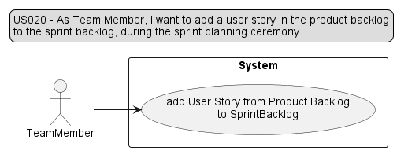
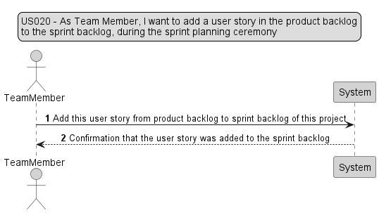
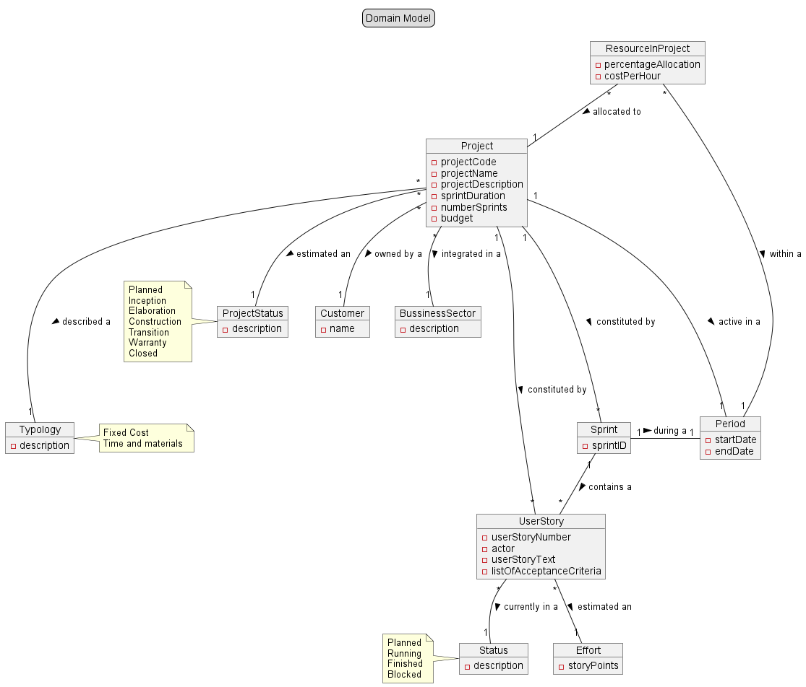
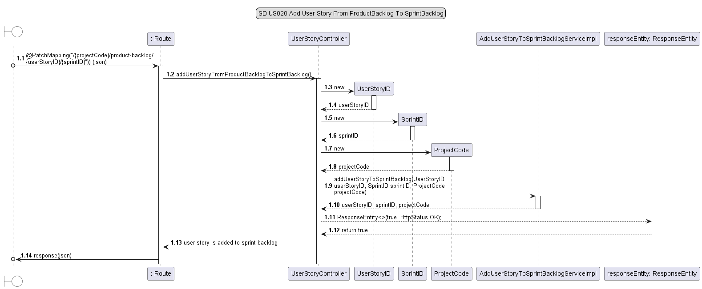
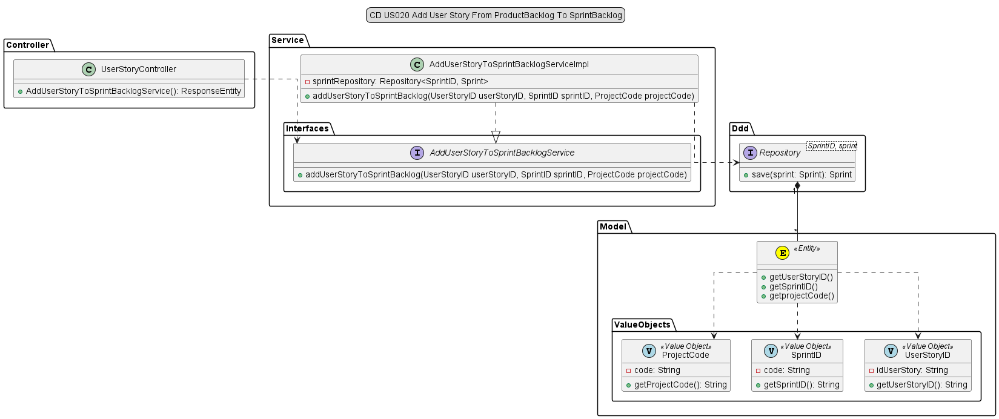

# US020 - As Team Member, I want to add a user story in the product backlog to the sprint backlog, during the sprint planning ceremony.

## 1. Requirements Engineering

### 1.1 User Story Description

The goal for this user story is to add a user story in the product backlog to the sprint backlog, 
during the sprint planning ceremony.

The Team Member attends the sprint planning ceremony where the Product Owner presents the product backlog items 
for the upcoming sprint.

Team Member reviews the product backlog items and identifies a user story that they feel is a priority for the sprint.

After that communicates their selection to the rest of the team and the Product Owner.

Then adds the selected user story to the sprint backlog.

Consequently, the Team Member ensures that the user story is clear, actionable, and has acceptance criteria.

The Team Member collaborates with the rest of the team to estimate the effort required to complete the user story.

Ensures that the user story is well-defined and understood by the entire team.

The team agrees on the user story and its acceptance criteria as part of the sprint commitment.

By following this User Story Scenario, the Team Member successfully adds a user story from the product backlog to the 
sprint backlog, ensuring that the team is committed to completing it during the sprint planning ceremony.

### 1.2 Customer Specifications and Clarification

*From the specification document:*

(page:3 - line(s):39-40):
In scrum, the requirements of the project are expressed as user stories and the set of all user stories (US) 
is the “project backlog”,...

(page:4 - line(s):5-7):
Each sprint has a “sprint backlog”, i.e., the set of US that should be addressed during the sprint. 
The definition of the sprint backlog is a joint effort of the PO and the team, during the sprint planning ceremony.

*From client clarification:*
>Question: 
>Em relação à US020, o Team Member pode adicionar ao Sprint Backlog qualquer User Story do Product Backlog, independentemente da sua prioridade?
>
>Answer: 
>Sim. A adição é feita no contexto do sprint planning. Vamos assumir que não é um disparate.
>

### 1.3 Accepted Criteria
* The user story added to sprint backlog must be in product backlog.
### 1.4 Found out Dependencies
* In order to be able to add a user story from product backlog to sprint backlog, the following
  dependencies where found:
  * *US016* "As Authenticated User, I want to get a list of all projects I'm currently allocated to."
  * *US018* "As PO/SM/Team Member, I want to consult the product backlog, i.e. to get the list of user stories sorted by priority."
### 1.5 Input and Output Data

**Input Data:**

* Project code
* User story code

**Output Data:**

* _User Story added to Sprint Backlog_

### 1.6 Use-Case Diagram (UCD)

### 1.7 System Sequence Diagram (SSD)

## 2. OO Analysis

### 2.1 Relevant Domain Model Excerpt

## 3. Design - User Story Realization

### 3.1 Rationale

| Interaction ID | US020          | Question: Which class is responsible for...                         | Answer                             | Justification (with patterns)                                                                           |
|----------------|----------------|---------------------------------------------------------------------|------------------------------------|---------------------------------------------------------------------------------------------------------|
| Step 1         | SD 1.2         | ... interacting with the UI layer, and coordinating the user story? | UserStoryController                | The Controller is responsible for receiving or handling a system operation to coordinate the user story |
| Step 2         | SD 1.3         | ... interacting with the controller?                                | AddUserStoryToSprintBacklogService | Information Expert: have access to all repositories                                                     |
| Step 3         | SD 1.4 - 1.5   | ... knowing the database?                                           | SprintRepository                   | Information Expert: knows/has all Sprints                                                               |
| Step 4         | SD 1.6 - 1.9   | ... showing the data?                                               | Sprint                             | Information Expert: knows its own data                                                                  |
| Step 6         | SD 1.13 - 1.15 | ... providing data to the UI?                                       | AccountController                  | Controller: informs operation success                                                                   |

### 3.2 Sequence Diagram

### 3.3 Class Diagram

## 4. Tests

* *Unit Test - Success*

        @Test
        public void testAddUSFromProductBacklogToSprintBacklog_withValidInputs_returnsTrue() {
        //Arrange
        String projectCodes = "PRJ1";
        String sprintIDs = "SPR1";
        String userStoryIDs = "US1";

        UserStoryID userStoryID = new UserStoryID(userStoryIDs);
        SprintID sprintID = new SprintID(sprintIDs);
        ProjectCode projectCode = new ProjectCode(projectCodes);

        when(addUserStoryToSprintBacklogService.addUserStoryToSprintBacklog(userStoryID, sprintID, projectCode)).thenReturn(true);

        ResponseEntity<Object> expected = new ResponseEntity<>(true, HttpStatus.OK);
        //Act
        ResponseEntity<Object> result = controllerUnderTest.addUserStoryFromProductBacklogToSprintBacklog(projectCodes, sprintIDs, userStoryIDs);
        //Assert
        assertEquals(expected, result);
        assertEquals(200, result.getStatusCodeValue());
        assertEquals(true, result.getBody());
        }

* *Integration Test - Fail*

        @Test
        public void testAddUSFromProductBacklogToSprintBacklog_withInvalidUserStoryID_returnsFalse() {
        //Arrange
        String projectCodes = "";
        String sprintIDs = "";
        String userStoryIDs = "";

        IllegalArgumentException exception = new IllegalArgumentException("User Story ID cannot be empty");
        when(addUserStoryToSprintBacklogService.addUserStoryToSprintBacklog(null, null, null)).thenThrow(exception);

        ResponseEntity<Object> expected = new ResponseEntity<>(exception.getMessage(), HttpStatus.BAD_REQUEST);

        //Act
        ResponseEntity<Object> result = controllerUnderTest.addUserStoryFromProductBacklogToSprintBacklog(projectCodes, sprintIDs, userStoryIDs);

        //Assert
        assertEquals(expected, result);
        assertEquals(400, result.getStatusCodeValue());
        assertEquals(exception.getMessage(), result.getBody());
        }

## 6. Observations

* It will be necessary later on to ensure that:
  * To list the projects you are assigned to, you will need to ensure that the account has a "user" profile and is a resource in the project.
  * The account must be assigned the "team member" role as a resource in project, in order to add the user story to the sprint backlog.