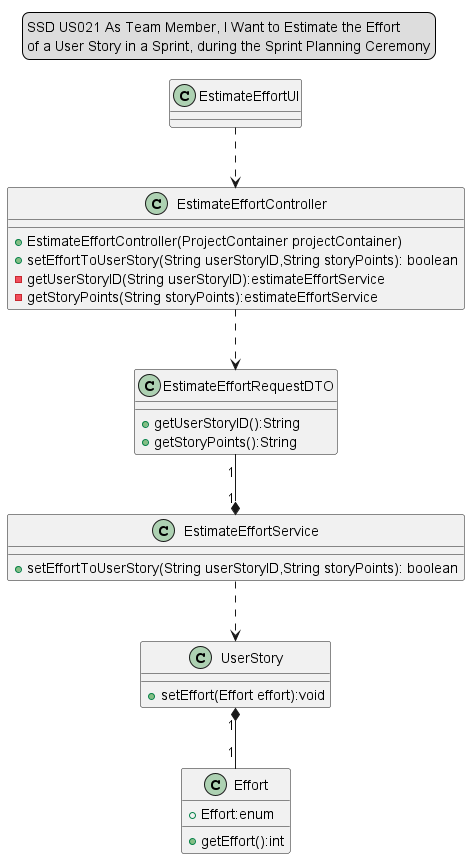

# US021 - As Team Member, I Want to Estimate the Effort of a User Story in a Sprint, during the Sprint Planning Ceremony

## 1. Requirements Engineering

### 1.1 User Story Description

#### As Team Member, I Want to Estimate the Effort of a User Story in a Sprint, during the Sprint Planning Ceremony

### 1.2 Customer Specifications and Clarification

*From the specification document:*

Each sprint has a “sprint backlog”, i.e., the set of US that should be addressed during the
sprint. The definition of the sprint backlog is a joint effort of the PO and the team, during the 
sprint planning ceremony. In this ceremony, an effort estimate is defined for each US, only
applicable to that specific sprint, so that it is possible to estimate the total effort in the sprint.

Effort estimate (start by having the initial estimate, but can be updated several times
throughout the project; uses Fibonacci series for duration in hours.);

*From client clarification:*

   Relativamente à US021, o esforço é em pontos do scrum poker (sequência de Fibbonacci adaptada, limitada a 40 pontos).
   Não vamos pensar, pelo menos para já, na estimativa em tempo. (by Angelo Martins)

### 1.3 Accepted Criteria
  * To estimate the effort of a User Story in a Sprint has to exist a project, a Sprint and a User Story.

### 1.4 Found out Dependencies

* In order to be able to add a resource to a project, the following dependencies where found:
    * US017 - As Product Owner, I want to create a user story and add it to the ProductBacklog.
    * US019 - As Project Manager, I want to create a sprint
    * US020 - As Team Member, I want to add a user story in the product backlog to the sprint backlog

### 1.5 Input and Output Data

*Input Data:*

 * UserStroyID
 * StoryPoints

*Output Data:*

* Success of the operation.

### 1.6 System Sequence Diagram (SSD)

[SSD021_EstimateEffortOfUserStory.puml](SSD021_EstimateEffortOfUserStory.puml)

### 1.7 Use Case Diagram (UCD)

[UCD021_EstimateEffortOfUserStory.puml](UCD021_EstimateEffortOfUserStory.puml)

## 2. OO Analysis

### 2.1 Relevant Domain Model Excerpt

[DM021_Domain Model Excerpt.puml](DM021_Domain%20Model%20Excerpt.puml)

## 3. Design - User Story Realization

### 3.1 Rationale

| Interaction ID | Question: Which class is responsible for...                                   | Answer                   | Justification (with patterns)                                                                       |
|----------------|-------------------------------------------------------------------------------|--------------------------|-----------------------------------------------------------------------------------------------------|
| Step 1         | ... interacting with the actor?                                               | EstimateEffortUI         | Pure fabrication                                                                                    |
| Step 2         | ... interacting with the UI layer?                                            | EstimateEffortController | Controller is responsible for receiving or handling a system operation to coordinate the user story |
| Step 3         | ... interacting with the controller?                                          | EstimateEffortRequestDTO | Information Expert: have access to all userstories and storyPoints                                  |
|                | ... interacting with the controller?                                          | EstimateEffortService    | Information Expert: have access to Sprint                                                           |
| Step 4         | ... add estimated effort a User Story in a Sprint?                            | UserStory                | Creator                                                                                             |
| Step 5         | ... providing estimated effort added to the UI?                               | EstimateEffortController | Controller: is responsible for sending the operation result                                         |
| Step 6         | ... exhibit estimated effort added of a User Story in a Sprint to the Actor ? | EstimateEffortUI         | Information Expert: is responsible for user interactions                                            |

### 3.2 Sequence Diagram

[SD021_EstimateEffortOfUserStory.puml](SD021_EstimateEffortOfUserStory.puml)

### 3.3 Class Diagram

[CD021_EstimateEffortOfUserStory.puml](CD021_EstimateEffortOfUserStory.puml)

## 4. Tests

* *Unit Test - Success*

        /**
        * Unit Test for addEffortInUserStory.
        */
         @Test
         void addEffortInUserStory() {
         // Arrange
         String userStoryID = "US1";
         int storyPoints = 2;
  
         EstimateEffortRequestDTO estimateEffortRequestDTO = new EstimateEffortRequestDTO();
         estimateEffortRequestDTO.setUserStoryID(userStoryID);
         estimateEffortRequestDTO.setStoryPoints(storyPoints);
  
         // Mock the behavior of estimateEffortService.setEffort() method
         when(estimateEffortService.setEffort(userStoryID,storyPoints)).thenReturn(true);
  
         ResponseEntity<Object> expected = new ResponseEntity<>(HttpStatus.OK);
  
         // Act
         ResponseEntity<Object> result = estimateEffortController.setEffortToUserStory(estimateEffortRequestDTO);
  
         // Assert
         assertEquals(expected.getStatusCode(), result.getStatusCode());
         }

* *Unit Test - Fail*

        /**
        * Unit Test for addEffortInUserStory (failure case).
        */
        @Test
        void addEffortInUserStory_Fail() {
        // Arrange
        String userStoryID = "US1";
        int storyPoints = 2;
      
        EstimateEffortRequestDTO estimateEffortRequestDTO = new EstimateEffortRequestDTO();
        estimateEffortRequestDTO.setUserStoryID(userStoryID);
        estimateEffortRequestDTO.setStoryPoints(storyPoints);
      
        // Mock the behavior of estimateEffortService.setEffort() method
        when(estimateEffortService.setEffort(userStoryID,storyPoints)).thenReturn(false);
      
        ResponseEntity<Object> expected = new ResponseEntity<>(HttpStatus.BAD_REQUEST);
      
        // Act
        ResponseEntity<Object> result = estimateEffortController.setEffortToUserStory(estimateEffortRequestDTO);
      
        // Assert
        assertEquals(expected.getStatusCode(), result.getStatusCode());
        }

## 5. Integration and Demo

* n/a

## 6. Observations

* n/a
